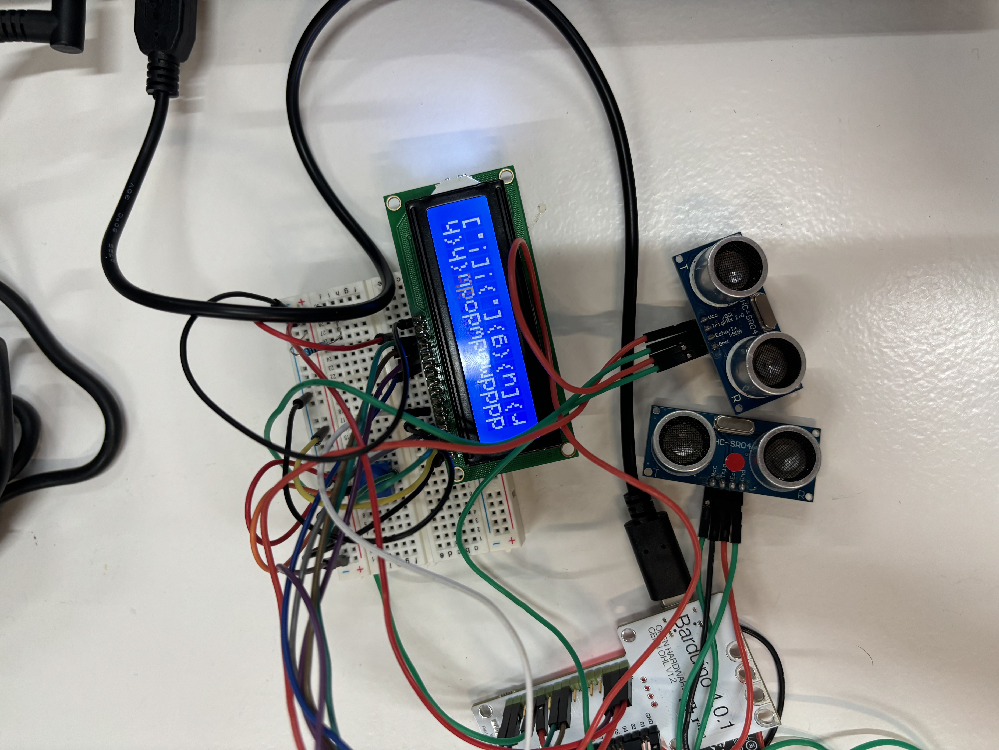
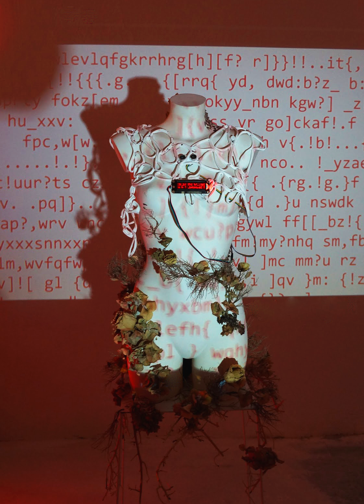

---
hide:
    - toc
---

# Master Project

## Where to start?

*I began my journey on this master's degree somewhat confused as to what my project interests really were, what I really liked to investigate until on 11 November 2023, 22-year-old Giulia Cecchettin was stabbed to death by her boyfriend of the same age and dumped in a ravine.*  
*The news, which happened in northern Italy, has gone around the world, and has in fact also arrived in my notifications.*  
*Although physically far away, I felt so immensely close and angry; then I understood:*  
*what you like must move something inside you.*

## Teaser video
<iframe title="vimeo-player" src="https://player.vimeo.com/video/948459805?h=e53dbf4272" width="640" height="360" frameborder="0"    allowfullscreen></iframe>

## First steps

I therefore sought, with the means at my disposal, a way to represent in a raw but aseptic way what gender violence meant to me.

I experimented with artificial intelligence, biomaterials electronics and soft sensors to realise that my research focus was on the body, but not as an entity in itself but as an interconnection of dynamics between two entities.

<iframe src="https://player.vimeo.com/video/948475560?badge=0&amp;autopause=0&amp;player_id=0&amp;app_id=58479" frameborder="0" allow="autoplay; fullscreen; picture-in-picture; clipboard-write" style="position:absolute;top:0;left:0;width:100%;height:100%;" title="pain_prompt"></iframe>

if you want to know more about my explorations give a look to [Design Studio](https://annafedele.github.io/mdef/term2/01-Design%20Studio%2002/) , [Digital Prototyping for Design](https://annafedele.github.io/mdef/term2/03-Digital%20Prototyping%20For%20Design/) and [Micro Challenges](https://annafedele.github.io/mdef/term2/Micro%20Challenges/) 

## The importance of language

It was the opportunity to dialogue with other people that made me finally express my own perspective in a relative first-person perspective.
I learnt how the physical dynamics between two bodies, even though they know each other, are always complex and confusing, especially when the situations result in violence and physical abuse.  
 

Language is the code par excellence that characterises a social unit, and is universal when it comes to complex concepts that need to be conveyed. 
But not the body, body language is intrisically influenced by generic but also personal connotations.
 
==So I asked myself, if in an alternative present it would be possible to break down this barrier and make body language a language of its own.==  
 
**If you cannot describe something in words, then that does not exist**

# < body > *as body syntax*

*Syntax, or syntactics (from the Greek σύνταξις, sýntaxis, "association, organisation"), is the branch of grammar and linguistics that studies the different ways in which the codes of languages join together to form a proposition.*

The project presented is a speculation on the role of technology in terms of gender-based violence. In more detail, the technology in question refers to all those wearable devices that are able to measure human parameters or relate them to their surroundings. 
It is about creating a language of one's own derived from body language related to proximity between two or more individuals
{: .image-45-size-right}

Through the fusion of technology and social awareness, our project offers a novel approach to combatting gender-based violence. By translating subtle body language cues into tangible text, we empower individuals to navigate social interactions with greater awareness and confidence, ultimately fostering a safer and more inclusive environment for all.

Details about how the project is developing in term of identity and future goals yuo can check [Communicating Ideas](https://annafedele.github.io/mdef/term2/04-Communicating%20Ideas/) and [Atlas of Weak Signals](https://annafedele.github.io/mdef/term3/01-AOWS2/)

### Purpose 

Establishing conversations and rising collective self-awareness among individuals on the issue of gender based violence so that technology and trans-humanism have a key role for solving events of physical violence
 
To best visualise my narrative, I chose the performing arts to represent the proximity between bodies.
The fluidity of dance interconnected with sensor technology give rise to a linguistic code that is the inescapable proof of interaction

## Collaborations: Giulia Del Gobbo and Ester Sole
During my journey I had the opportunity to collaborate with people who helped me to develop both conceptually and practically. I collaborated with Giulia del Gobbo, an Italian designer who is currently studying "Critical Inquiry Lab" at the Design Academy in Eindhoven. our collaboration was more of a verbal and brainstorming type, but really useful to find another point of view, as she developed a project around gender violence: This project is about recreating a workshop where products are used to rewind
[her work!](https://fliphtml5.com/lzbwg/fphh/Book_Del_Gobbo_Giulia/)

# MDEFFest 2024

<iframe width="768" height="432" src="(../images/design_studio/NEWSPAPER.pdf)"></iframe>

<iframe src="https://player.vimeo.com/video/964291969?badge=0&amp;autopause=0&amp;player_id=0&amp;app_id=58479" width="1920" height="1080" frameborder="0" allow="autoplay; fullscreen; picture-in-picture; clipboard-write" title="&lt; body &gt;, as body syntax"></iframe>