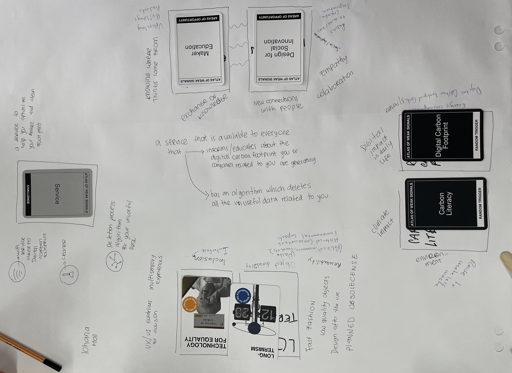
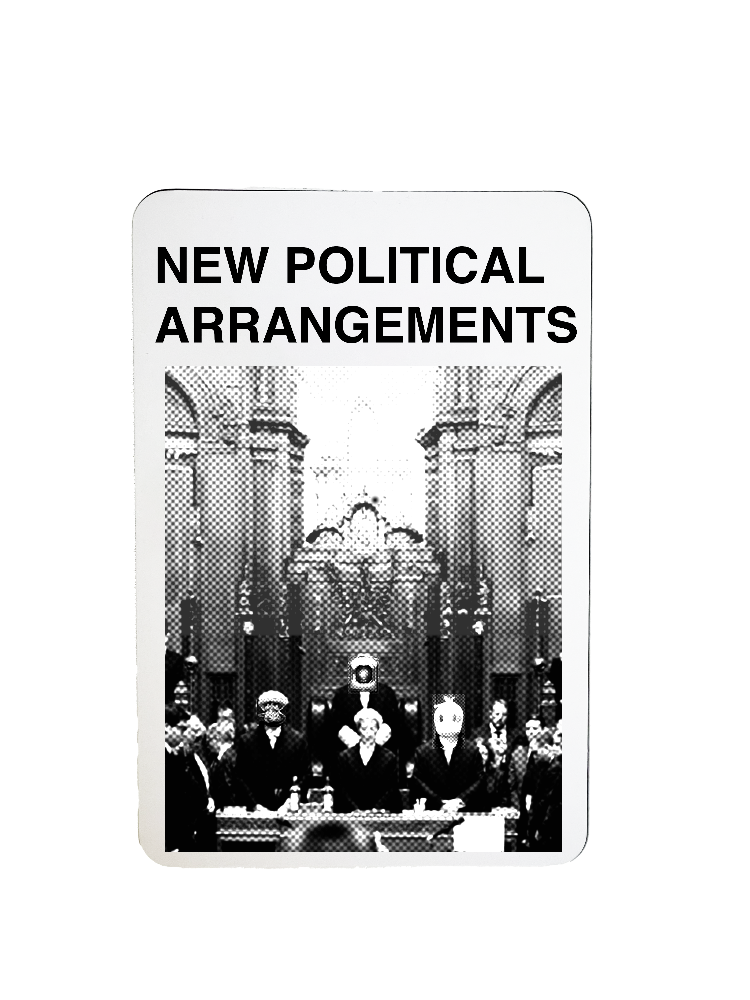

---
hide:
    - toc
---

# Atlas of Weak Signals

In the seminar “Atlas of weak signals”, they explained us how to build our *Design Space,* as a space of interests we’d like to investigate in many field related to an emergent future situation. They give us many ways of defining a design space, but the one that I’ve preferred, it’s the design space as a *mirror*: I can clearly see it as a reflection of my inner person, as a professional and non figure.

## Key roles

**Situating**, understanding surroundings (links with collaborative realities)

**Organizational**, reducing complexity, making sense

**Narrative**, understand your own narrative

**Performance or Performative**, combining design spaces, (collaborative design spaces ), as giving yourself a feedback 

**Inspirational,** link projects, state of the art.. 

In order to build our space, we’ve firstly played this sort of card game: it contains cards for **weak signals, areas of opportunity and random triggers**, in order to stimulate dialogues between each other and develop a an idea-project for an specific emergent future field. I find this exercise interesting and stimulating in thinking by steps: the game starts first with weak signals, areas of opportunity and random trigger, giving us the possibility to create links between the cards step by step, developing a layered mental process.

We did an example in class:

## My own AOWS

Looking at all the cards in the deck,i decided not to follow a precise methodology, instead I’ve preferred to let me guide on what weak signals interest me the most.

I was intrigued in “Reconfigure your body” and “Dismantling filter bubbles” because i feel them close to my personal experience and I’ve related them to a state of versatility of the body that it has always to change in order to sustain our fast lifestyle and erase the isolation created by algorithm (filter bubbles) that they convey our everyday life online and also how this could de in an close future.

## New cards for the deck

I’ve also thought of a new weak signal to add to the deck, and I’ve named it “**New political arrangement**”: according to me, society will develop in the future - in a negative or positive way- with its own facets and declinatios that, for me, are constantly evolving. For this reason, also politics and political parties, establish to collect society’s ideas and willingness, will constantly change their arrangements, so it should be take in consideration as a weak signal.

