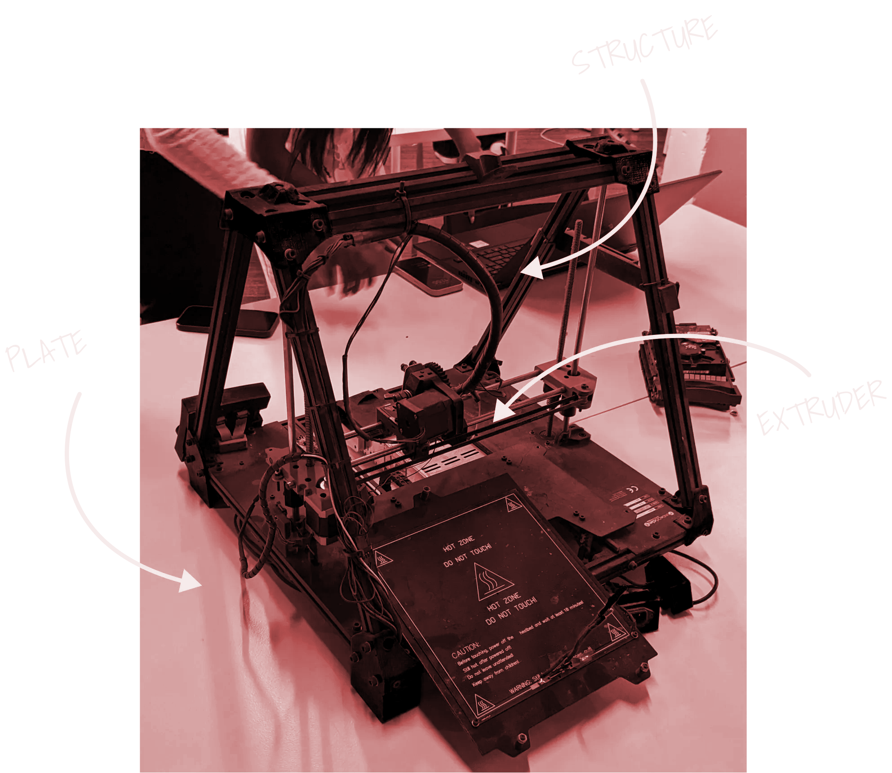
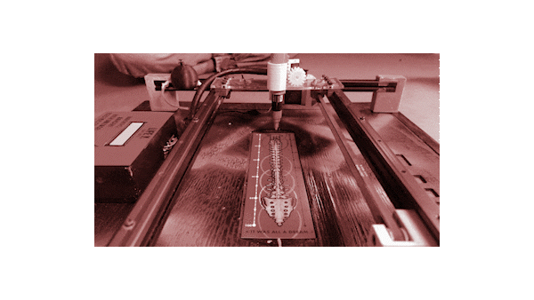
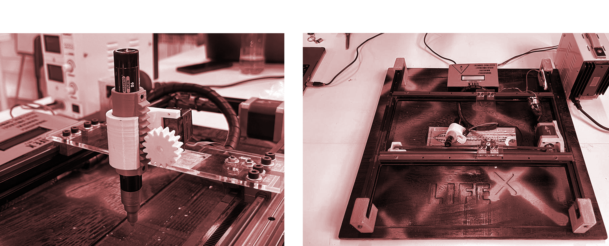

# THE MACHINE PARADOX
*17.10-27.10*

[3D MODEL](https://sketchfab.com/3d-models/3d-printer-e502641d13b24bd5b1fdc4618c199533)

## Forensic Report: FundacioCIM 3D Printer

> Serial number: 01 150929 1189 
Brand: FUNDACIOCIM 
Year: 2015
Model: BCN3D+
Weight: 11,6 kg 
Colour: BLACK/BLUE 
Made in: SPAIN 
>
### **Forensic Questions**

**What does it do?**‍

A 3D printer is a device that creates three-dimensional objects by layering material based on a digital design. Using a computer-aided design (CAD) model as a blueprint, the printer adds material layer by layer, whether it's thermoplastic, resin, or metal, to form a solid object. Different printing technologies, such as Fused Deposition Modeling (FDM), Stereolithography (SLA), or Selective Laser Sintering (SLS), dictate the type of material and the layering process, resulting in a tangible product that mirrors the digital design.

‍

**How does it work?**

The 3D printer works by interpreting a digital 3D model, slicing it into thin horizontal layers using specialized software, and then building the object layer by layer through additive manufacturing. Depending on the technology used, the printer deposits material, such as thermoplastic filament, liquid resin, or metal powder, layer by layer, with each layer fusing to the one below. The material is solidified using various methods like heating, UV curing, or laser sintering, resulting in a three-dimensional object that matches the digital design.

‍

**How is it built?**

The 3D printer is constructed using a combination of mechanical, electronic, and software components. Mechanically, it features a frame that houses the moving parts, including the print head or extruder, and a build platform. These components are driven by motors, guided by linear rails or rods, ensuring precise movements on the X, Y, and Z axes. Electronically, a main control board processes digital instructions from the slicing software, directing the motors and regulating the temperature of the print head or curing source. Additionally, various sensors monitor conditions like temperature and filament presence, while the software interface allows users to configure settings, load models, and initiate the printing process.

‍

**Why it failed, or it wasn’t used anymore?**

The 3D printer still functions, but it's an older, unstable model with low accuracy and print quality.

## **Powering things up**

‍
After the disassembly process, we meticulously examined each individual component. Utilizing a precision lab power supply and a high-resolution multimeter, we conducted comprehensive tests to determine the optimal voltage required for each component's functionality.

‍ ??? **WHAT WE POWER UP**

- DC Lab Power Supply - How we brought individual 3D Printer components back to life
- We monitored the temperature of the hot plate while gradually increasing the voltage
- We check the temperature sensor looking at the values
- We dissasemble the part of the extruder

## **Results**

**How many motors did we find inside?**

Five motors - they are used to move the extruder in the three axis to permit drawing in 3D space.

‍

**Does it contain a computer or microcontroller?**

Yes, an Arduino board and a RAMPS.

**Did you found any sensors?**

Yes, temperature sensors.

## **Conclusions**

**What did you learn?**

- How a 3D printer is assembled
- How a 3D printer works
- How to power up each component individually
- Fundamental electronics
- How a step motor works

‍

**What surprised you?**

- The number of components, screws and pieces the printer had
- The fact that we can make the extruder work with just 3 components
- How easy and repareable it is
- How much the 3D technology has improved since 2015

## **(Almost Useful) Machines - LifeX**

In Week 2 of the 'Machine Paradox' phase, we took our achievements from Week 1 to the next level. While the initial week was dedicated to disassembling and testing individual components, this week presented us with a unique challenge: to innovate and craft a new product using parts extracted from the printer. An intriguing twist to this assignment was the directive to design the machine to be as whimsical and non-functional as possible. This encouraged us to let our creativity run wild and embrace a playful approach.

Even with a treasure trove of components at our disposal from the 3D printer—including two motors, an extruder, and more—we embraced an audacious and captivating concept: the LifeX, a so-called 'life expectancy predictor'.

‍
> At its core, LifeX uses the X-axis motor and belt system. With a simple push of a button, a pen draws a line on a paper below, supposedly predicting the age at which the user will pass away. It's a tongue-in-cheek nod to the dubious claims of some fortune tellers. In truth, an Arduino board is programmed to halt at a random number, influenced by the moment the user activates it.
>

The motor maneuvers the pen across what we playfully dub your 'life bookmark', a creation thoughtfully crafted by one of our talented team members. This ticket, more than just a whimsical prediction, serves as a keepsake from this pseudo-paranormal encounter. Hold onto it and cherish the memory of this unique experience!

We were privileged to be part of a diverse team, boasting a rich tapestry of skills from varied backgrounds. This multidisciplinary blend, from engineering acumen to artistic flair, was instrumental in propelling our project to completion. It was this collective genius that birthed such a unique and delightful machine.

One of the most captivating stages of our journey was the decision-making process regarding which parts to repurpose from the printer and what additional elements we would introduce. We strategically utilized only essential components, complementing them with bespoke pieces crafted through 3D printing, CNC, and laser techniques—thanks to the advanced digital fabrication facilities available at our school.

## personal reflection

Finally, I really enjoyed this seminar because it gave me the opportunity to actively participate in the process of assembling a functioning machine. It was a different experience for me because I had never experimented with this concept before. I also never fully understood the technical aspects ( more related to coding and programming) of a product or anything else. As a designer, I always saw that part as something that did not interfere with my work, mainly because it seemed too complex to comprehend. Well, it is indeed complex, but the reality is that working superficially to complete a task is no longer sufficient. It is essential to understand every aspect of our surroundings in our field.

We worked excellently as a team! Each of us had our individual skills in specific areas, but we collaborated with one another on every task, learning from each other and also from failure: during the process we met a lot of obstacles, about the code, the 3d printed parts, the working mechanism... but i've really like that we work toghther for solving them ,or reshaping the project with some constraints that we met.

<iframe title="vimeo-player" src="https://player.vimeo.com/video/878611346?h=13229e04f0" width="640" height="360" frameborder="0"    allowfullscreen></iframe>
