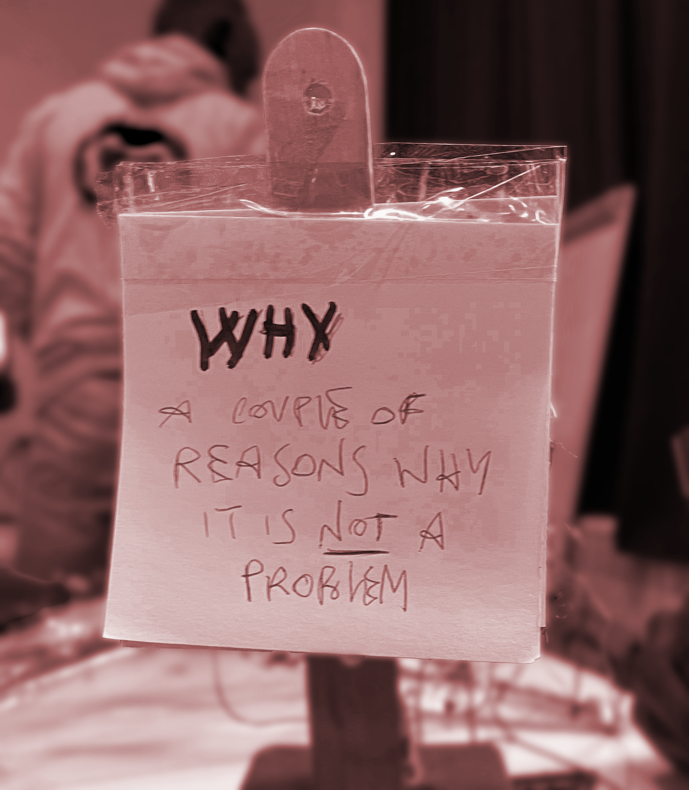

# LIVING WITH YOUR OWN IDEAS
*31.10-03.11*

During this seminar we focus on the concept of ==fist person perspective==

**1st Person Research→** 

- to be situated as actors in environment and generate change
- taking your own culture in a specific project (involving yourself as a political act)
- interventions deals with different temporalities
- involve ourself to understand the interaction around us (relational and expansive)
- look at things, being involve
- decentering humans by displacing power relations (making yourself vulnerable)

After talking about 1pp we start with prototyping a ==companion== 

## WHY, A COUPLE OF REASONS FOR...

COMPANION, INDIPENDECE THE NEED TO BE SELF-RELIANT

{==how will you live together?==}

- it should be on my desk, or hang somewhere in my room ,or in a place where i usually work.

{==what does it notice?==}

- it notices in me self-confidence in my potentialities. it basically gives “reason” under shape of little post-it (gives by pressing buttons). With reasons i mean some topics that let me understand that what i’m doing, even if it’s right or wrong, it is something that in a sort of way, matters.

{==what were you thinking?==}

- i was thinking to a way that a machine could contribute in my everyday life, referring to my anxiety about my professional skills, something that can say to me that there’s no problem in making mistakes or also in having self-confidence in my skills and ideas. The machine it also has an additionally “photo and other things” holder where it should be a picture of my dog, because his presence makes me always calm and safe.

{==why does it matter?==}

- it matters because it is time for me to be more self-confident

