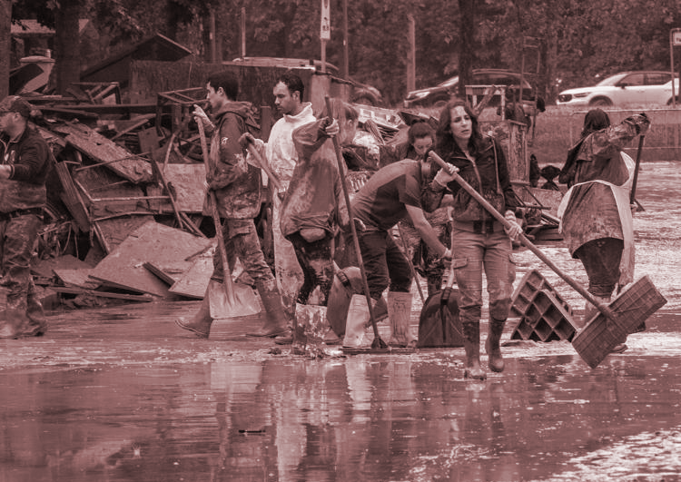
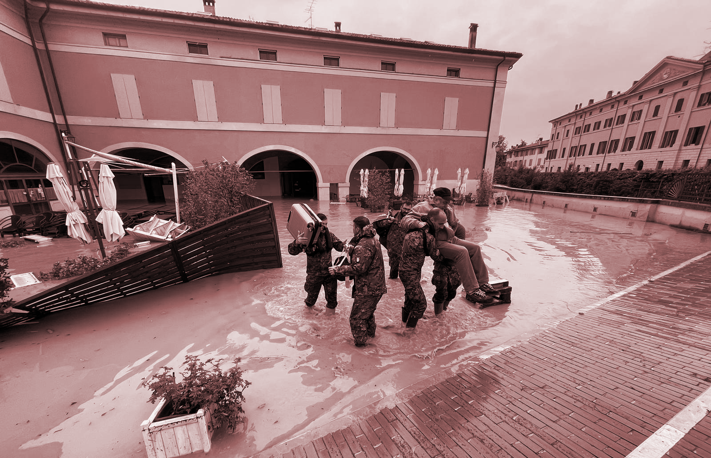

# Bio & Agri Zero

*07.11-17.11*

# FIRST WEEK: Bio Zero

## Growing bacteria 
The second day we prepared some recipes for growing bacteria cultures.

??? danger "Breeding Grounds"

    Breeding grounds are solid or liquid solutions containing nutrients on which eukaryotic and prokaryotic cells can grow. Bacterial media, those on which bacterial and other prokaryotic colonies can grow, are simpler than eukaryotic media.

{: .image-half-size-left }

In groups, each one prepared a recipe for growing bacteria: with my group in order to cook Lactobacillus, we prepare this recipe with lemon, milk and agar agar. The process of making the  recipe and thyen puring it into the petri dishes really intrigued me because it's really important about paying attemtion to mantain the environment sterilised.
The next step was to "contaminate" the petri dishes with everything that can start a bacteria culture, for example hairs, spit, but also swapping some objects inside.

{: .image-40-size-left}
{: .image-40-size-right}

 

Unluckly, the most our our petri dishes didn't grow cultures during the night :(

## GMO PROPOSAL: a natural defense against pathogenic microorganisms in sludges

My proposal for a genetic modified organism is strictly related at series of events that led to a tragedy in my region Emilia-Romagna (IT), in May 2023: 40,000 people had to evacuate their homes due to sudden flooding of canals that filled entire cities with water and mud, taking 16 victims with them.

The flooding and geological occurrences were caused by continuous rainfall resulting from an occluded weather front that originated from the Atlantic. This weather front was fueled by a Mediterranean cyclone. These weather conditions led to extensive flooding, overflowing rivers, and landslides across the region from May 2nd to May 17th, 2023.

  
  

Following the flood, numerous institutions stated that the event was accentuated by the inadequate management by the Emilia-Romagna Region of its territory, in particular its failure to intervene on the problems of hydrogeological instability and legislation on soil consumption.
This type of calamity not only brings extreme discomfort due to the loss of property and the difficulty of telecommunications within a town, but also to human health.

The water, in its path from the river or canal, carries with it a considerable amount of debris from the surrounding land or sewage from the probably clogged sewage system.These, fed by the flow of water, appear as piles of mud that stagnate even after the water has been removed. In the case of the floods in Emilia-Romagna, entire cities were covered in mud, which struggled to be cleared away, despite the large number of volunteers who rushed to the scene.

{: .image-half-size-left }

In view of this, my GMO proposal aims to prevent the spread of bacteria within the water-borne mud during a flood.Certain fungi such as the mycelia of the Pleurotus and Phanerochaete are known for their ability to decompose polycyclic aromatic hydrocarbons (PAHs) and other pollutants in the soil. They are already being used for bioremediation actions.

Fungi such as Pleurotus ostreatus and Phanerochaete chrysosporium are known for their ability to degrade organic compounds, including hydrocarbons, through a process called biodegradation. These fungi produce extracellular enzymes that break down complex organic molecules, including hydrocarbons, into simpler compounds that can be absorbed and used as an energy source.
The key enzymes involved in the breakdown of hydrocarbons are mainly oxidases, laccases, peroxidases and lignin peroxidases. These enzymes are responsible for breaking chemical bonds in hydrocarbons, making them more easily degradable and assimilable by fungi.

I therefore identified certain types of plants that can be found near rivers and canals, and plants typical of green areas in cities, which, if strategically placed, could immediately absorb pathogenic microorganisms within the activated sludge and thus purify it. (as examples)
- Phragmites australis
- Juncus
- maples
The combination of the genes of these fungi, which are adept at decomposing hydrocarbons and purifying the soil, with some of these plants, could therefore be the beginning of a responsible use of the soil to stem certain misfortunes such as flooding, but at the same time be useful to everyday life by allowing cities to preserve, in green areas, usable soil for growing plants.

REFERENCES
*Vágvölgyi, C., Vörös, M., Bóka, B., Pucarević, M., Jovanović, L., Panković, D., & Manczinger, L. (2014). Degradation of phenol derivatives by a phanerochaete chrysosporium strain. Review on Agriculture and Rural Development, 3(1), 161-164.*

*Caporaletti, A., & Caporaletti, A. (2023, May 18). Alluvione in Emilia-Romagna, reportage dall’apocalisse: pioggia, fango e dolore sotto un cielo di pietra. Quotidiano Nazionale. https://www.quotidiano.net/cronaca/alluvione-emilia-romagna-reportage-05a64574*

*SITNFlash. (2015, August 11). How to make a GMO - Science in the news. Science in the News. https://sitn.hms.harvard.edu/flash/2015/how-to-make-a-gmo*

!!! danger ""

    ## Reflection
    According to me, having a general overview about something more related with biology and other species is really useful to understand and collaborate what does it means to live with other living organism and move from the anthropocentric vision that humans have been created for themself. I’ve really enjoyed all the week listening and learning about fields i’ve never investigate so this stimulate me for a little reflection out of the academic context. 

    It’s very interesting getting more into biology related to design so using other organisms to “solve actual problems”, thinking about the benefits of spirulina, the usage of bacteria and viruses for vaccines,the practice of CRISP-Cas9, and so many other amazing things that really fascinate me but at the same time it seems quite selfish, using them for our own issues. The anthropocentric vision then has not shifted much?

# SECOND WEEK: Agri Zero

# Visiting Valldoura campus

{: .image-40-size-left}
{: .image-40-size-right}

 
.gif>)
 
 
## Making essential oils

<iframe width="560" height="315" src="https://www.youtube.com/embed/1yX_C6PKxl8?si=UAU-9f7q19j3_z2l" title="YouTube video player" frameborder="0" allow="accelerometer; autoplay; clipboard-write; encrypted-media; gyroscope; picture-in-picture; web-share" allowfullscreen></iframe>