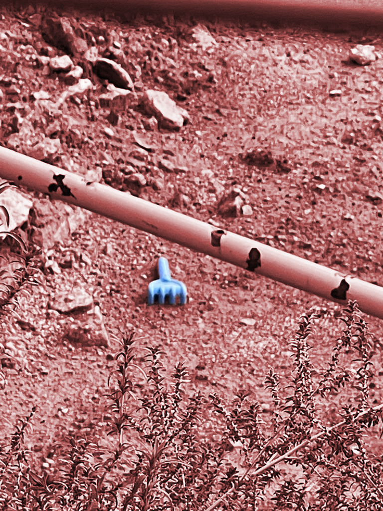
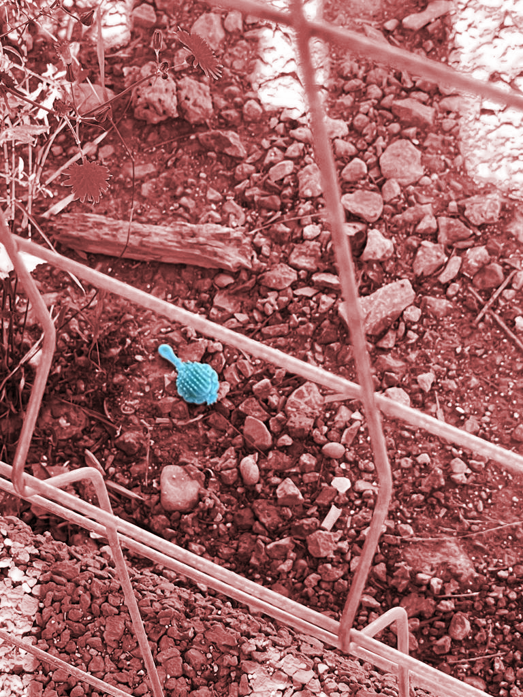
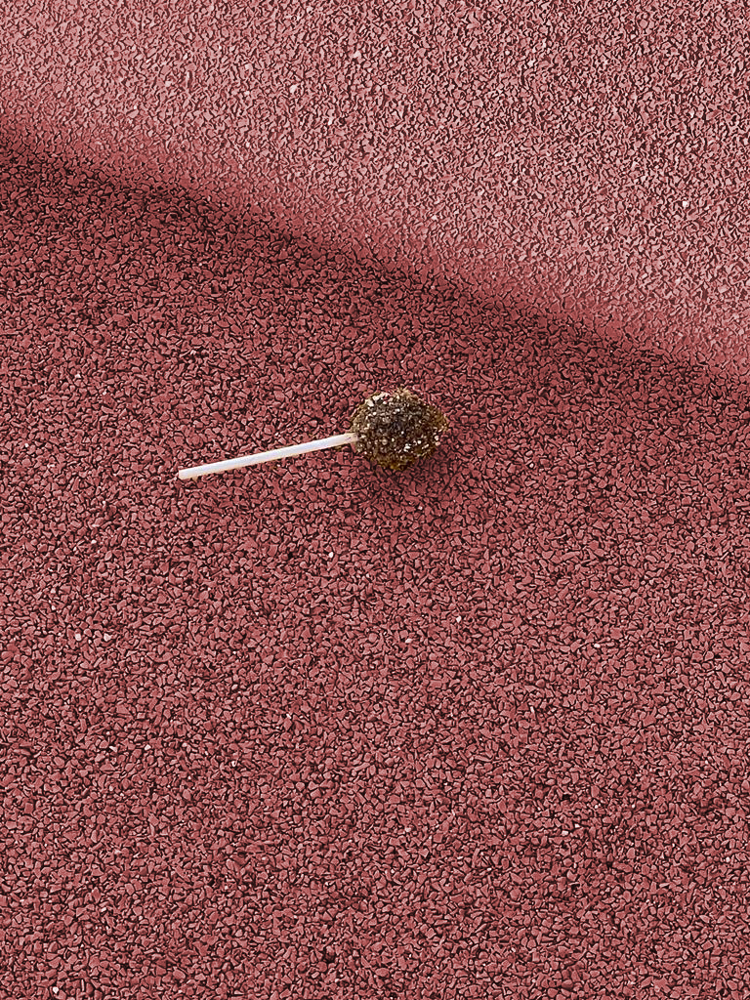
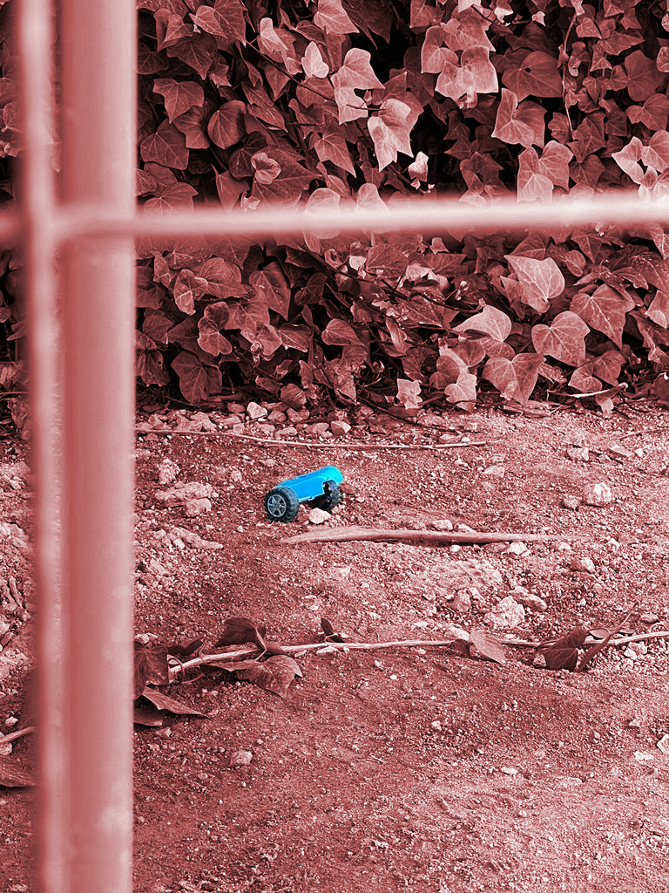

# Design With Others

WHAT’S A COMMUNITY? COLLECTIVE OF THINGS/BEINGS, complex formation of elements 

Paradoxes of SOIL AND LAND (FOOD AND HOUSING)
SOIL as nature cultural system, more than human community, sub-human
LAND as sociotechnical system, micro and macro natural system, creative arena
FROM MICRO TO MACRO (perpetual shifting)
LOCAL SYMPTOMS, COMMUNITIES AND SITUATED RESEARCH 
→ SYSTEMIC, MACRO-long TERM INTERVENING 
**UNDERSTANDING, CONNECTING, INTERVENE** 

##  DAY 1, SOIL

*ASSAMBLAGES→ Assemblages are composed of heterogeneous elements or objects that enter into relations with one another. These objects are not all of the same type. Thus you have physical objects, happenings, events, and so on, but you also have signs, utterances, and so on. While there are assemblages that are composed entirely of bodies, there are no assemblages composed entirely of signs and utterances.* 

ASSEMBLAGES OF SOIL-> Mix of microorganisms (or issues of waste) connecting elements issues ,logistics, infrastructures , 

As a first activity, they ask us to go around and take picture on what for us could be a *friction,conflict or tension* in soil.
During my research hour i've noticed that in that specif area, (close to a playground) that there were a lot of toys leave by the children. 
i've reflected on the fact that children, unlike the others, don't "*trought*" away something on the ground and leave it on purpose: their intentions are pure (as a angel generation)  and they also use the soil as their fantasy playgrond.

{: .image-half-size-left}
{: .image-half-size-right}
{: .image-half-size-left}
{: .image-half-size-right}

Back from the activity, i found my affinity group sharing the concept of **AGEISM**

## AFTERNOON ACTIVITY

**Build a systemic view of your territory**

- Stakeholder mapping and analyze the context through an holistic diagnosis
- Ensure the alignment of your internal team vision for circular transitions and be aware of constraints and differences

**Assess your community**

- Engage the community through canvassing, door knocking, and participating in community events.
- Understand the barriers of sharing power and/or access that prevents diverse co-creators from coming and working together
- Address those barriers and include their voices. It takes work and it is hard, but the output will be stronger.

DISTRIBUTED DESIGN→ approach to design that goes from product in trash out to product in and out 

Spread, thought data KNOWLEDGE (A COMMUNITY) 

MAKER MOVEMENT→ working with design sensitivity 

# DAY 2, LAND

LA BORDA→ social housing, sharing spaces collaborative space (they collaborate to build the space and the utilities)

Freedom as exercising reciprocity (way of relating)

# SOIL AND LAND (CONFLICT SPACE)

CONFLICT: people getting outdated 

productivity, doing more in less time

who already working on reinsert people in society in cataloya

<iframe width="768" height="432" src="https://miro.com/app/live-embed/uXjVNMzGq0o=/?moveToViewport=-41455,-8156,35679,37539&embedId=157409310942" frameborder="0" scrolling="no" allow="fullscreen; clipboard-read; clipboard-write" allowfullscreen></iframe>
<iframe width="768" height="432" src="https://miro.com/app/live-embed/uXjVNK1eVv4=/?moveToViewport=115,-1635,3305,1691&embedId=688868365891" frameborder="0" scrolling="no" allow="fullscreen; clipboard-read; clipboard-write" allowfullscreen></iframe>