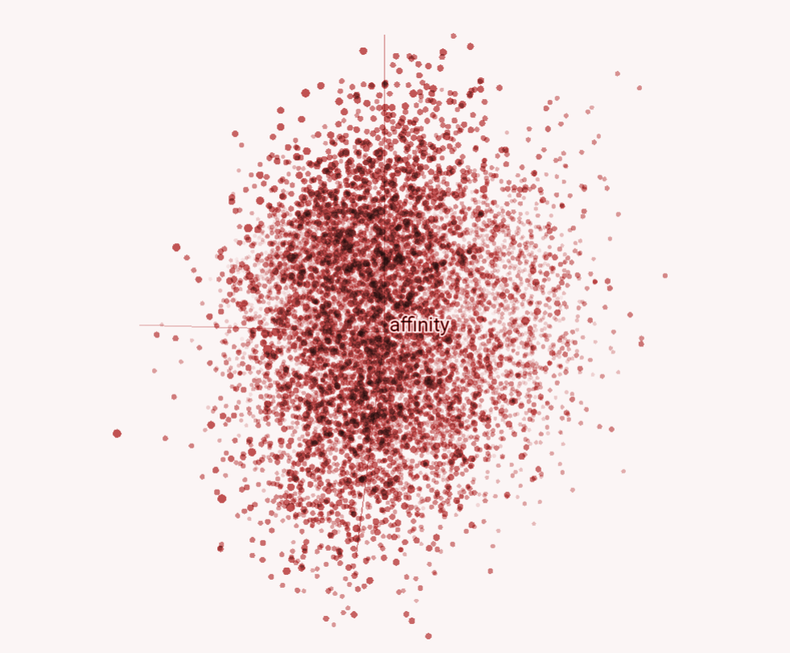

*27.11-05.12*

> *At its most basic, machine learning means automating tasks by providing examples (training data) instead of writing instructions (code). Fueled by the rise of new algorithms, new hardware, new toolkits for efficiently solvin*g complex problems, and huge datasets compiled from everything from sensor networks and surveillance cameras to social media, machine learning has come of age.”*
>

|   |                          |
| ----------- | ------------------------------------ |
| `NEURAL NETWORK`       | - ***global architecture capable of self-configuration from examples*** |
| `DATASET`       | sample data to provide to the network |
| `TRAINING`    | self-configuration process of the network based on the dataset |
| `MODEL`    | Configuration of a neural network after training on one dataset|

## Visiting the exhbition "AI: Artificial Intelligence" at CCCB

We had the chance to visit the AI exhibition here in Barcelona, that, i've personally really enjoyed because it displays the relationship with AI in many different fields, traslated into projects that explore the capabilities of this new frontier.
In the entire exhibition i've found some projects that really interest me:

## Latent spaces

*Formally, a latent space is defined as an abstract multidimensional space that encodes a meaningful internal representation of externally observed events.*

I find this concept really load of meanings, but also, the way as this is dispayed in a digital way even if it's something really teoretical is really fascinating.

## Project free-bias texts

Nowadays we are constantly bombarded with facts, news, articles that attempt to persuade readers and mystify the reality of the facts. It is not easy to extrapolate the news as it is because it is constantly influenced by the geopolitical conditions of a country, its current of thought, and which side the journalists are on.

Our idea of AI project ==is to train an AI for detecting and highlighting biased words in an article or a text, to let the readers be aware of what they read and how to collect the
information== of any event that happened in the word in order to create and develop bias-free thoughts.

In addition, our project is useful for detecting biased words in order to erase discrimination factors that are insightful in many fields.

If a tool utilizes AI to remove biases from text but is trained on pre-existing biased data, it runs the risk of inadvertently perpetuating or introducing biases rather than mitigating them. 

The effectiveness of bias removal tools heavily depends on the quality and diversity of the training data.

??? danger ""

    ## Reflection
    This week was an eye-opening experience that exposed me to the multifaceted world of artificial intelligence. One concept that truly fascinated me was the exploration of latent spaces. The idea of encapsulating complex data in a simplified yet meaningful manner resonated deeply with me. 
    A significant motivation for undertaking this course was to comprehend how AI could be harnessed to tailor solutions to specific needs or purposes. Understanding the mechanisms behind developing AI systems that align with objectives ,accoding to me, is really fondamental on nowdays and i want to persue it.

    The project revolving around free text analysis were undeniably captivating on the complexities and ethical dilemmas intertwined with AI. The exploration of bias within free text projects was particularly thought-provoking: is it possile not being influenced by any type of bias according to the provenience, the society, religion.. ? if is so hard for human beings, how can a model perform impeccable detection and elimination work? i think, that AI ethcs and possibielities are still work in progress...

