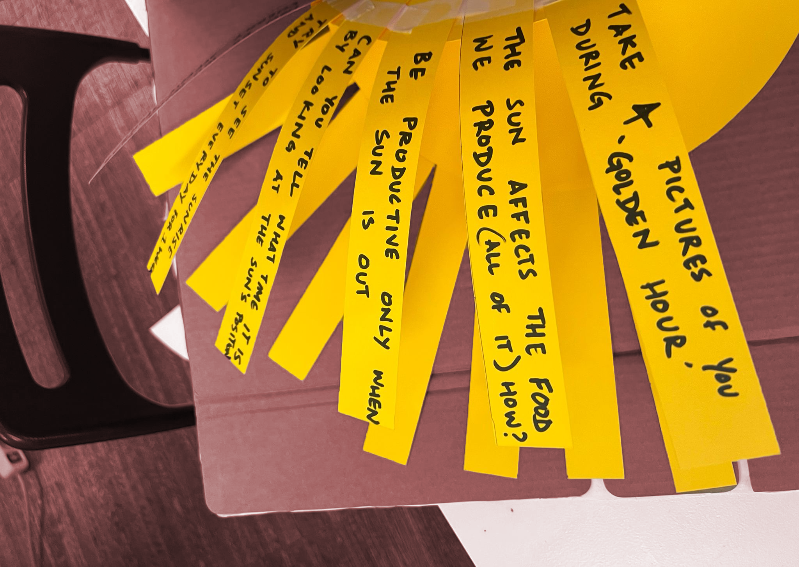
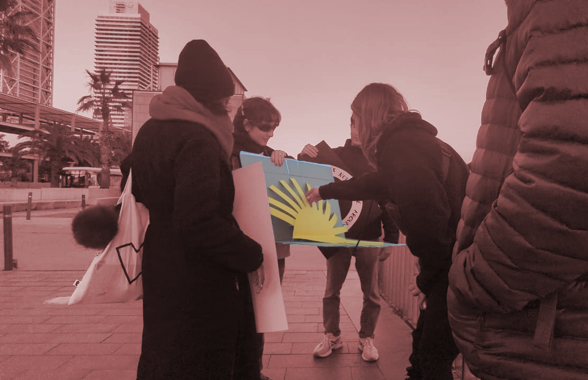
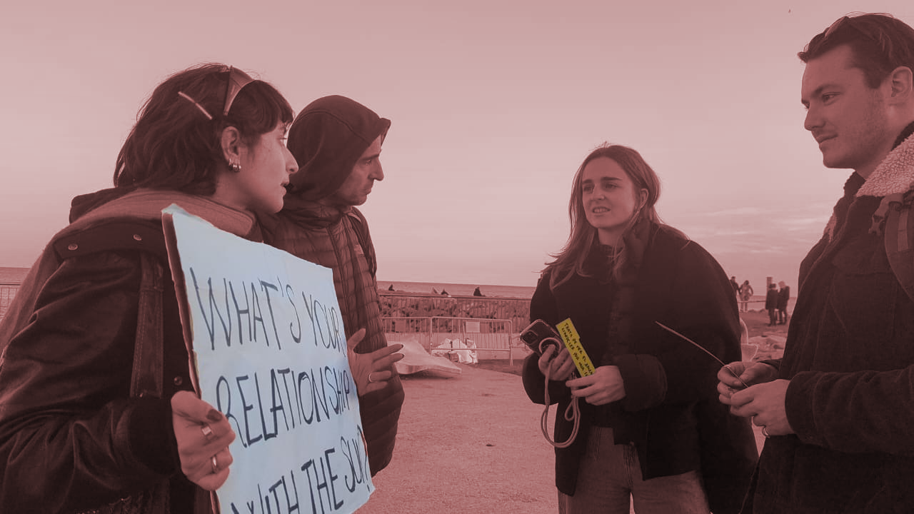
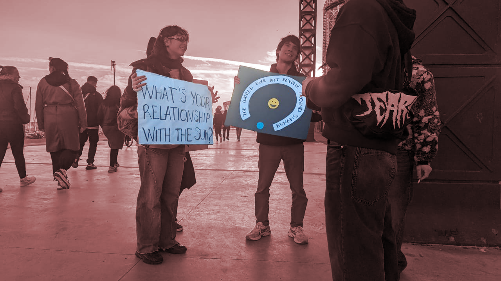

*9.01-12.01*
<brr>

This seminar was an insight into the issues surrounding the climate emergency and the role design can play in curbing them.
For this to happen, it is important for each of us to understand where we stand in the world, whether we are privileged or not, what our backgrounds are in order to internalise the right approach.
Summing up, we spent a week absorbing a lot of information on the main issues concerning the climate emergency and developed a reflection on them that led us to choose the focal points that intrigued us most to stimulate dialogue.

??? danger "**climate emergency→**" 
    - the planet is too hot
    - environment and animals are suffering
    - Collapsing of human civilization
    - OUT OF TIME

#### Term Polycrisis

The first presentation introduces the concept of Polycrisis and from there develops a series of considerations determined by its meaning:

*Polycrisis→ (Adam Tooze) The word of the moment appears to be 'polycrisis', defined by Collins ==as the simultaneous occurrence of several catastrophic events.== It's apt, given the war in Ukraine, inflation, the pandemic…*

Into groups, we then discussed which points caught our attention the most:

ABSTRACTIONS
    - We life in a society full of *abstractions*. 
    - The humanity is lost in abstractions some steps beyond or behind reality.
    - Being humans has been reduced as being ==users==.
    - A transition from human-centered design to solar-centered design
    - Responsibility as a designers of how we use the words because *the words can shape the worlds.*

SOLAR-CENTERED DESIGN
    Being more in **synch with natural rhythms**, especially with our star, who is the phenomenon that reigns most of the biological rhythms on Earth.
    - Energy availability
    - Circadian rhythm
    - Rethink our activity cycle
    Learning from the wisdom of indigenous and native cultures that follow/respect natural solar cycles

As a "solution" we thought about the meaning and application of the word ==**interdisciplinarity**==
- Now the technologists are more aligned with scientists, biologists, ecologists
- **Collaboration of knowledge**
- Sharing of different points of view
- More inclusive, multicultural direction
- Enables balance of power because of ==collaboration and not imposition==

##  Discussing our relationship with time and growth, 
*with Gustavo Nogueira, Temporality Lab*

The lecture kicked off with a captivating introduction, seamlessly weaving together philosophical insights, scientific knowledge, and indigenous wisdom. This set the stage for a thought-provoking exploration that bridged the gap between diverse disciplines and perspectives. As the discussion unfolded, a substantial focus centered on the intricate concept of Time.

{: .image-45-size-left}

> This lecture really interested me because I have always been fascinated by the concept of time, its different conceptions and how it is explored in different areas: for example, the concept of relativity related to the passage of time, or the disruption of the flow of time in European literature at the beginning of the 20th century, or even the cyclical conception of time from a more philosophical aspect.
I often stop to think how the passing of minutes, hours days or years is a mere convention invented by man to quantify the passing of a life.  We spend time scheduling events on a fictitious time organisation that is now lost with the solar day because we are used to living at night, we have artificial lights and entertainments that sometimes make us lose time.
Yet time only flows in one direction, towards things we do not yet know, and it does not stop.
>

## Field Trip
{: .image-45-size-right}
On the last day we made posters on some of the themes that had impressed us most during the week and, walking around Barceloneta My group and I focused on solar-centred design and the relationship humans have with the sun. We therefore made an interactive poster where there was a sun inside, and respectively each of its rays contained a sentence or a question on which we encouraged passers-by to reflect.
We felt this was a more engaging way to get attention and talk about sensitive issues such as the climate emergency, as people tend to be intimidated by threatening phrases about the climate emergency and perhaps shy away from participating in a conversation.

<brr>
<brr>

{: .image-45-size-left}
{: .image-45-size-right}
