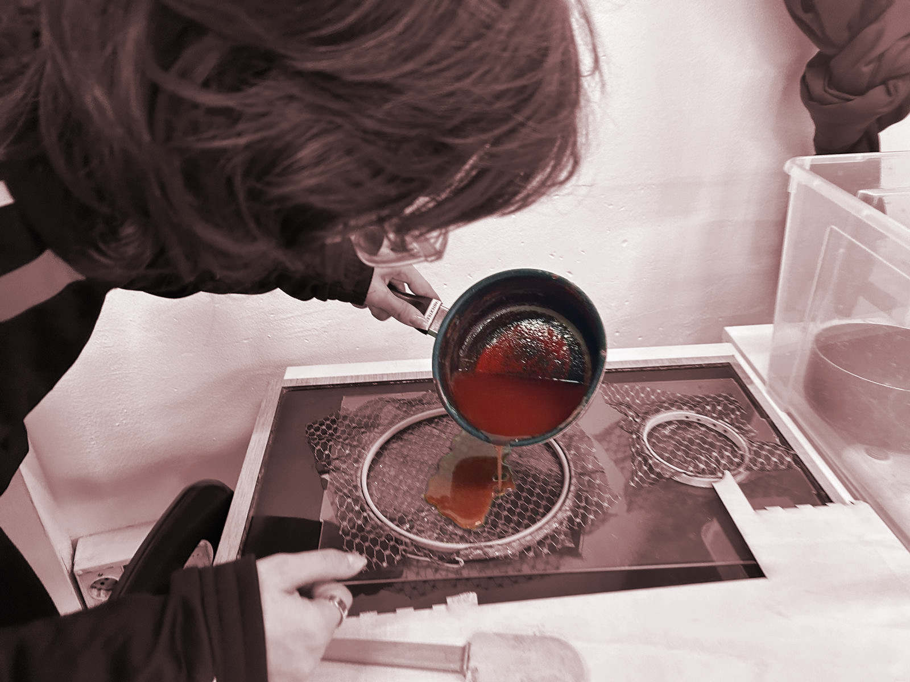
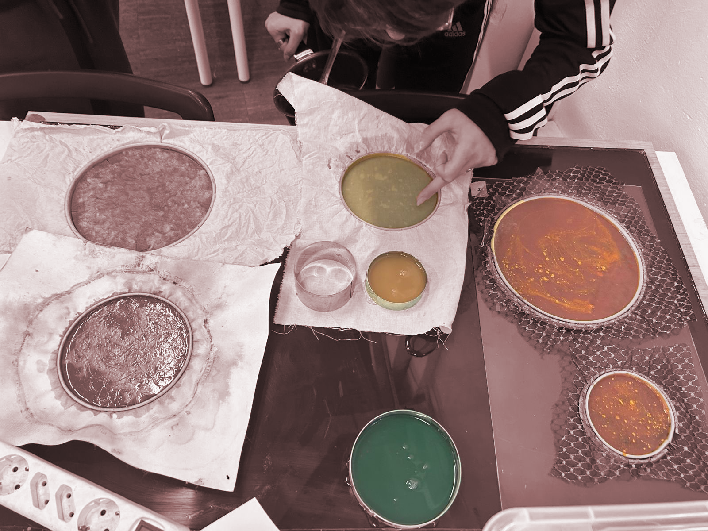

# TASK 1:

*Creating a project using bio materials and laser cutter*

## Touch sensor

*For Design Dialogues I, I’ve start my research related the connections of the body with its surroundings, and more specifically when acts of violence are inflicted by one body on another for sexual or passionate reasons (gender-based violence, feminicide). I presented a reflection on the concept of healing wounds and my desire to recreate a biomaterial that could simulate, in some way, human skin. firstly, I focused on the concept of healing, wondering if I could therefore make a biomaterial conductive. I performed a few tests, two of which proved positive.*

For the following exercise, Flora and I discussed these issues, converging my interests with hers related to the dynamics of contact between two bodies: we wanted to make visible a perception of being touched and at the same time investigate what the feedback of the skin in contact with a bio-material was.

We therefore thought of making, starting from the experiments I had previously carried out, a touch sensor that would turn on a small LED as a feedback response to touch.

<iframe width="768" height="432" src="https://miro.com/app/live-embed/uXjVN3uqsSI=/?moveToViewport=-317,-168,654,491&embedId=982645797564" frameborder="0" scrolling="no" allow="fullscreen; clipboard-read; clipboard-write" allowfullscreen></iframe>

I had already made a touch sensor using conductive tape and the biomaterial only as a coating.
This time we wanted to test the sensor using conductive biomaterial instead of cables

.png>){: .image-45-size-left}

We began by defining two biomaterials that respectively occupy the roles of the sensor's coating, i.e. the visible outer part that will be laser-cut, and the conductive biomaterial that will be placed inside the sensor.
Both of these two recipes are based on Agar Agar

{: .image-45-size-left}
{: .image-45-size-right}

<brr>
<brr>

??? danger "*Agar recipe*"
   - 300ml water
   - 10 g agar agar
   - 16g/32g glycerol (depends on the flexibility of the material we want to obtain)

We decided to use salt in order to create a biomaterial that can conduct electricity, in fact:
*sodium chloride in the liquid state or in aqueous solution is a good conductor of electricity. This is because it dissociates into sodium (Na+) and chloride (Cl-) ions when in this form. The charged ions allow electric current to flow through the solution.*

We did, however, face some difficulties as we were not aware of the amount of salt required to conduct electricity with a 3V battery (i.e. the smallest and therefore least bulky battery that we could fit in the sensor); furthermore, the drying time of a biomaterial (in this case agar) varies up to five days, if we do not create too thick a sample, so it extended the time for which we could test conductivity.
In fact, we did several tests with different amounts of salt and came to the conclusion that if more than 20 g of salt are mixed, the conductivity with 6V is obtained.