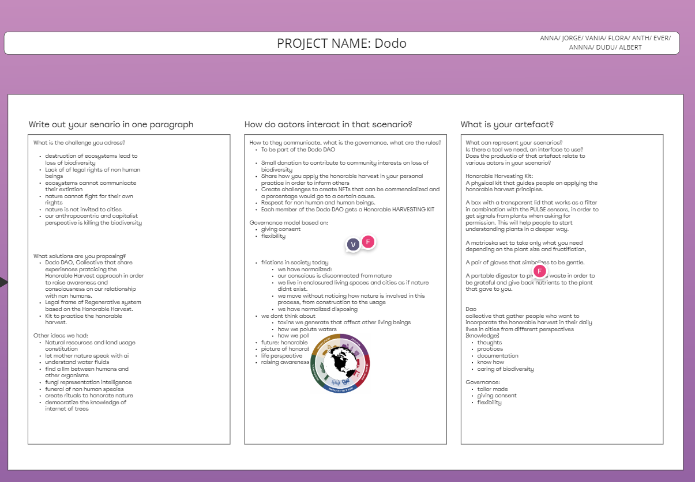

*23.01-26.01*

## *FAIR FUTURES*

In this seminar we learned about how to manage with non tangible technologies, i.e. some methods that can be used by artists and creators to disseminate their works in the digital world but at the same time preserve their originality and make fair sales.

Some terminologies we explored:

*blockchain*→ connective structure of block who has information (2008) 

*decentralized ledger*: shared, open, collaborative, transparent, immutable, verificable, secure, privacy aware

*NFTs*→ A *non-fungible token* is a unique digital identifier that is recorded on a blockchain and is used to certify ownership and authenticity

*Smart contracts*→ computer program or a transaction protocol that is intended to automatically execute, control or document events and actions according to the terms of a contract or an agreement

*DAO’s*→ *distributed autonumous organization*, organization with rules in smart contracts, In general terms, DAOs are member-owned communities without centralized leadership.

*LLM*→ deep learning algorithms that can recognize, summarize, translate, predict, and generate content using very large datasets.

|  | Commons Governance |
| --- | --- |
|  | 1. Community boundaries |
|  | 2. Rules adapted to local conditions |
|  | 3. Participatory decision-making |
|  | 4. Monitoring |
|  | 5. Graduated sanctions |
|  | 6. Conflict resolution mechanisms |
|  | 7. Recognition by higher authorities |
|  | 8. Multiple layers of nested enterprises |

## Dafne+
→ decentralized platforms for fair creative content distribution which empowers creators and communities through new digital distribution models based on digital tokens (NFTs).  ​

## Dodo project

Our project was based on the loss of biodiversity, a topic that is really complicated to address without with no more regard for human beings than for other living beings. Probably, it is the anthropocentric view on the subject of biodiversity that leads it to be so complicated to satisfy. That is why, after much brainstorming, we focused on plants and how they have no say when it comes to using them. We based our LLM on 'The Honorable Harvest', i.e. a list of  honoring the indigenous legacies that teach us how to commune with our planet. 
## *The Honorable Harvest*
    1_Ask for permission   
    2_Listen for di answer  
    3_Tale only what you need and no more  
    4_Minimize harm  
    5_Use everything that you take  
    6_Be grateful  
    7_Reciprocate the gift

 
To make the contact between people and the honourable harvest more tangible, we devised a kit that step by step metaphorically but at the same time concretely follows the THH rules.

 
 

