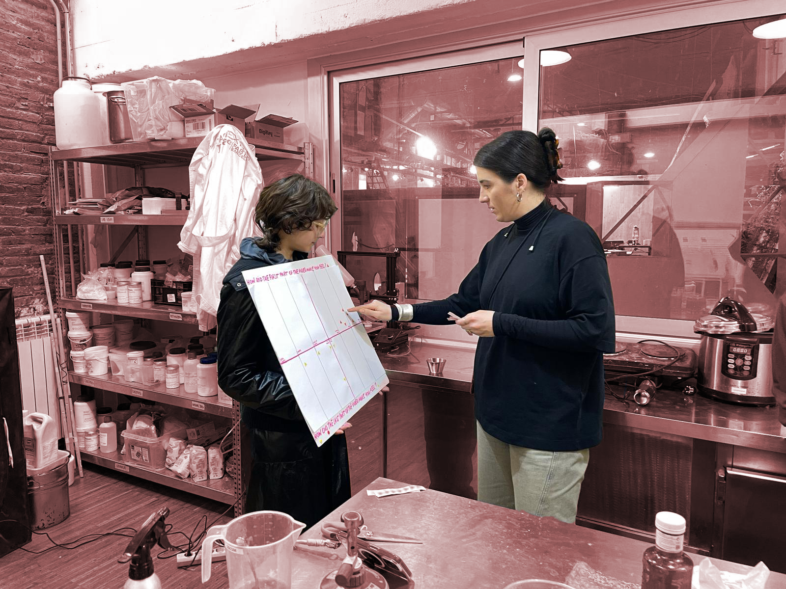
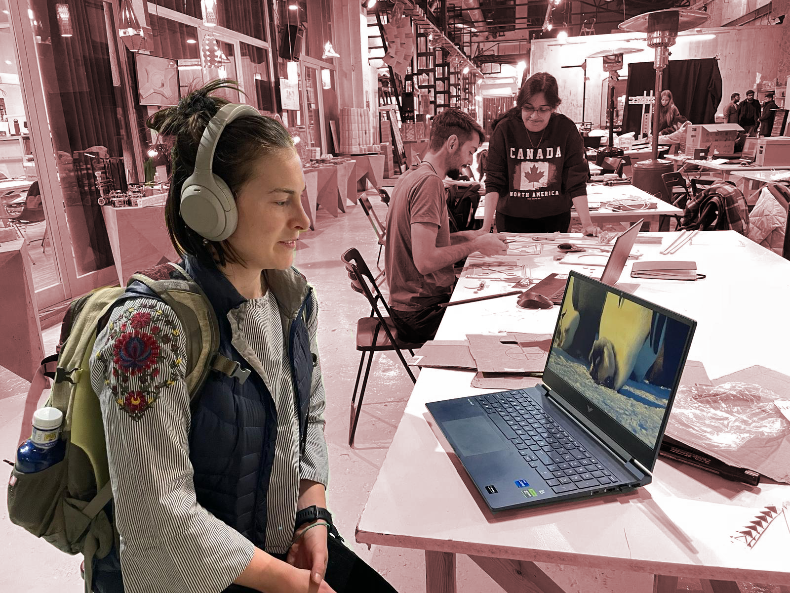
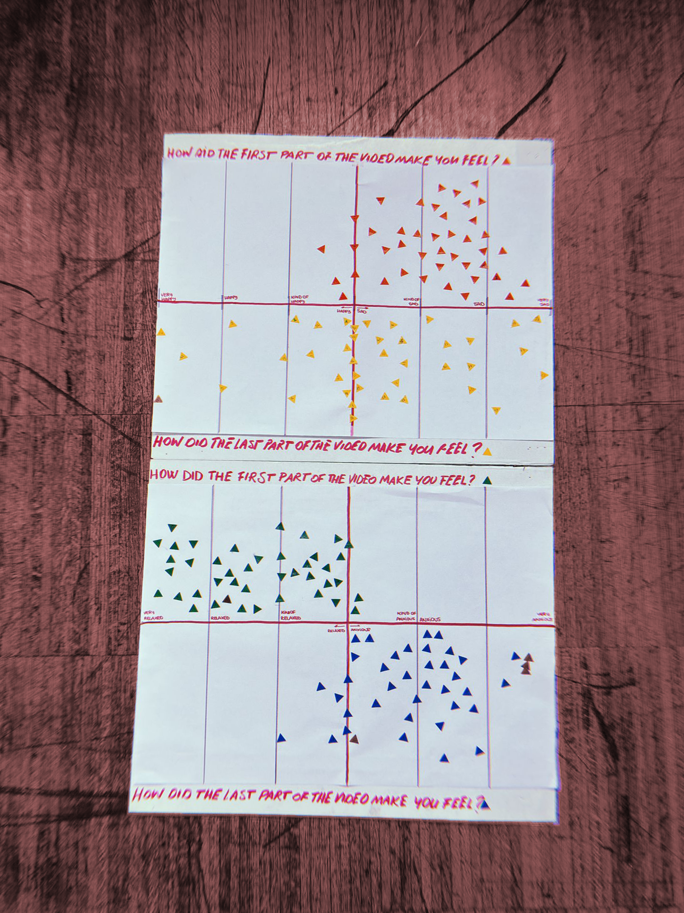

## Collecting data project: Let's get physical! 
*Carmen Robres, Sophie Maradon, Vania Bisbal, Francisca Herrera, Anna Fedele*

We wanted to collect data on emotions and feelings, something connected to our identity and mental health. It was a bit hard to actually come up with a specific "we want" statement because we kept on thinking about what we wanted to measure and experiment with instead of a main objective.

**Statements:**
Can music change your emotions? -> Music can not change your emotions
Does music help you connect? -> Music does not help us connect

**Project Goals**
Objective: ==We want to use music to make people feel better==
Question: Can music change your emotions?

## Null Hypothesis
### Music can not change your emotions

## Ideation process
The tool we used involves ==physical interaction==. Initially, our intention was to utilize the camera with the Raspberry Pi to connect to an AI capable of recognizing emotions, thereby allowing us to observe changes through facial expressions.
 

For the physical interaction tool, what we did was edit two videos: ==one with a sad context and the other with a relaxed context. In both videos, we used different songs.== In the sad video, we started with a sad music track and then transitioned to a happy one. In the relaxed video, we began with a relaxed song and then switched to an anxious one.
 

[[video 1!!](https://youtu.be/vgvYHuiI424)]

[[video 2!!](https://youtu.be/WweWlX8CcDY)]

In order to make it interactive as a physical intervention, we created billboards containing the questions:

*"How did you feeling in the first part of the video?"*
*"How did you feel in the second part of the video?"*

{: .image-45-size-right}

Each person who responded placed a sticker on the billboard next to their answer. We kept track of each person by assigning numbers to them and their stickers

[[our journal](https://hackmd.io/@5Xw3T7P2Q4mDSSXn1KG2XA/SyZ8j0ljT/edit)]

## Conclusion and Results
- We successfully altered people's mood by adjusting the music in a video.
While we observed mood variation, we couldn't control the emotions people felt. This discrepancy could be attributed to individual and cultural backgrounds; participants may have had differing moods at the outset of the video, influencing their responses. Incorporating background tracking could have provided deeper insights.
- There might be a bias due to the loss of surprise from video 1 to 2. Participants can anticipate the dynamics, potentially yielding different results if the order of the videos is changed.
- Using neutral background music makes it easier to evoke the intended emotion. However, when a recognized song is used, the mood change might reflect individuals' feelings about the song rather than the intended emotion.
- The sad/happy video yielded inconclusive results, possibly due to the song choice.
We managed to prove our hypothesis wrong. Music can change your emotions but the mood change depends on the individual's background.

[Our presentation][(https://www.canva.com/design/DAF8SojQySw/FwO3hOtByobo4-F1C2cG3g/view?utm_content=DAF8SojQySw&utm_campaign=designshare&utm_medium=link&utm_source=viewer)] 