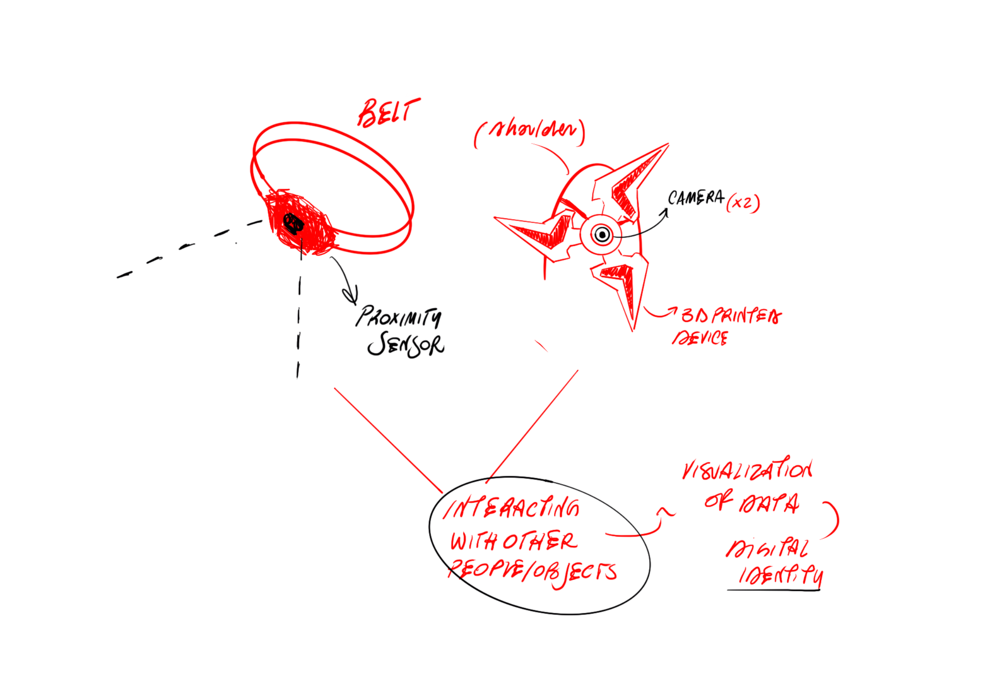

# MicroChallenge: detecting the surroundings 
Contributors: Anna and Annna

## Areas of interests:

In our discussions, we found some areas of common interest such as an interest in sensors and a digital alter ego that could represent feedback from surroundings.

## Research
By intersecting our research, we found a common point in looking for wearables that collect data in certain social contexts, from events to everyday life, also related to the concept of protection. Certain types of sensors can detect changes in our surroundings that affect our bodies and our attitude under the circumstances.

### Statement:
Series of investigation on electronic wearables that detect the surroundings and the interations with them, and that translate it in a digital visualization 

# Artifact Description:


## Project planning


## Sketches




## Materials and technologies needed

- **Touch Sensor: Conductive textile**


https://docs.google.com/presentation/d/1v8qUhaarRCpX2TFIQKuj19j48BwxF2szUg2qXhQy8u8/edit#slide=id.g43aa799330_0_357


- **TTGO Camera**


https://www.tiktok.com/@espn/video/7153418979409874222?lang=es 

https://www.tiktok.com/@jordi.koalitic/video/7106530718012017926 


https://www.youtube.com/watch?v=LtBzbDm66wU&list=PLg4I7mDs8xeGnVRUS_2si_TmjoE82I342&index=44
Steps for use:

1. Connect to the camera's Wi-Fi network.
 

2. In the web browser, navigate to: 2.2.2.1


3. url of the stream: http://2.2.2.1:81/stream 


- **Touch Sensor: Conductive Biomaterial**
- **Proximity sensor**


In many of our projects, we have the need to sense our environment, to know if there is an obstacle in front and at what distance it is located. The HC-SR04 sensor allows us to do this.

The HC-SR04 sensor is a distance sensor that uses ultrasonic transducers to detect objects.
Its operation consists of emitting an ultrasonic sound through one of its transducers, and waiting for the sound to bounce off any present object; the echo is captured by the second transducer. The distance is proportional to the time it takes for the echo to arrive.
- **Resin Printing**
- **Pla Printing**


## Fabrication process


Our first main idea was to create a outfit, composed by a belt and a skin wearable that allow to collect data while the person who is wearing them is constantly reacting with the surroundings, ad then, translating then in a digial identity made of the data.

### Touch Sensor: Conducive Biomaterial: 
We started cooking the conductive biomaterial for creating a touch sensor that works even with pressure
Recipe: <br>
  **alginato de Sodio  + CMC Celulosa** <br>
  Agua 200ml <br>
  Alginato de sodio 8g <br>
  CMC Celulosa 12,5g <br>
  Glicerina 10g <br>
  Harina  100 g <br>
  Carbon <br>
  
  

After discussing together we realize that for the time we had and the tests we supposed to do with the biomaterial, we decided to dedicate ourselfs to the sensors, as the proximity.

During the first review the professors suggested us to use cameras for recordigns video of the surroundings and have a sort of 360 view (as the cars have in their assets) related also to the topic of safety and protection we want  to address; so, we start investigating with the TTPO cameras.
https://github.com/annafedele/microchallenge/assets/143884501/2e62ab73-343f-420e-96c8-4eee715032ec
<br>

### Touch Sensor: Conductive Textile:

We also tried to make a touch sensor with textiles and the **velostat**: 
*Carbon impregnated black polyethylene film. Conductivity is not affected by humidity or aging*
-Pressure and bend sensor <br>
-Resistance decreases across distance and changes under pressure. <br>
-<500 Ohms/cm v
-Carbon impregnated black polyethylene film. Conductivity is not affected by humidity or aging. <br>

For creating the touch sensor we use also the conductive tape, that we stick on the fabric of both sides, for indicating the positive and negative pole and then a layer of foam for isolating the two poles.


We applied a hole in the foam for creating the "button" and the layer of velostat, so we the button is pressed the ciurcut can run releasing data.


### TTGO Camera: 
We use a TTGO Camera to detect, view, and analyze the things around us. We found it interesting to use as it provides us with a different perspective on ourselves that we cannot achieve from our first-person view.

The original idea was to connect the camera to a 3D program in order to visualize and play. We wanted to connect the camera live to TouchDesigner.

We encountered many issues with just visualizing the camera in its original program. 
We used the URL ( http://2.2.2.1:81/stream ) to connect the IP to TouchDesigner,


To obtain that link: press Control + Shift + I, select the camera, and it will provide you with the URL link.

using the Video Stream in TOP in Touch Designer. 

https://derivative.ca/UserGuide/Video_Stream_In_TOP *Video Stream In Top Node Documentation.*


However, even after many attempts, we were unable to find a solution. 


### Proximity Sensor:
We use the proximity sensor to detect the distance of objects and people. <br>

We manage to connect the data that the sensor give in the serial monotior of arduino with touch designer: at first we imported the data and then we transformed in values. With touchdesigner it is possible to apply the variation of values to some features of the geometry you model so at the beginning we apply the modification to the geometry and the to the texture.


### Resin Printing: 


### PLA Printing:


## Fabrication files
### *code that we used for proximity sensor*
```proximity sensor
int TRIG = 2;
int ECHO = 4;
int DURATION;
int DISTANCE;

void setup() {  
  // Sensore ad ultrasuoni
  pinMode(TRIG, OUTPUT);
  pinMode(ECHO, INPUT);
 
  // Seriale
  Serial.begin(9600);
}

void loop() {
  digitalWrite(TRIG, HIGH);
  delay(1);
  digitalWrite(TRIG, LOW);
  DURATION = pulseIn(ECHO, HIGH);
  DISTANCE = DURATION / 58.2;
 
  if (DISTANCE > 0 && DISTANCE < 50) {
    Serial.println(DISTANCE);
    delay(100);
  }
}
```
### *code that we used for touch sensor:*
```touch sensor
#include "pitches.h";
#define touchPin T2
const int threshold = 80000;
const int threshold2 = 80000;
const int threshold3 = 100000;
const int threshold4 = 120000;
const int threshold5 = 140000;
const int ledPin = 13;
const int ledPin2= 11;
const int buzzer = 10;
int touchValue;
int pitch = 0;
void setup()

{
Serial.begin(115200);
delay(10); // give me time to bring up serial monitor
Serial.println("ESP32 Touch Test");
pinMode(ledPin, OUTPUT);
pinMode(ledPin2, OUTPUT);
pinMode(buzzer, OUTPUT);
}

void loop()
{
touchValue = touchRead (touchPin);
Serial.println(touchRead(T2));  // get value using T1
delay(10);
if (touchValue > threshold) {
    // turn the LED on
    digitalWrite(ledPin, HIGH);
}
// if it's lower than the threshold
else {
    // turn the LED off
    digitalWrite(ledPin, LOW);
}

// if the value is greater than the threshold
if (touchValue > threshold5) {
    // turn the LED on
    digitalWrite(ledPin2, HIGH);
}
// if it's lower than the threshold
else {
    // turn the LED off
    digitalWrite(ledPin2, LOW);
}
if (touchValue > threshold) {
    pitch = NOTE_C2; 
} else if (touchValue > threshold2) {
    pitch = NOTE_AS7;
} else if (touchValue > threshold3) {
    pitch = NOTE_A7;
} else if (touchValue > threshold4) {
    pitch = NOTE_GS7;
} else if (touchValue > threshold5) {
    pitch = NOTE_D8;
} else {
    pitch = 0;

}
if(pitch == 0) {
    noTone(buzzer);
} else {
    tone(buzzer, pitch);
}

if (pitch == 0) {
    noTone(buzzer);
} else {
    tone(buzzer, pitch);
}
delay(10);
}
```


# Learning outcomes
## Results
At the end of the challenge, the difficulties we encountered were not few, because when it comes to investigating and improvising with technology, a lot of testing is required, and especially when you are a novice, it is complicated to make things work in a reasonable time.
<br>


The results we achieved are very good in terms of investigation and discovery of new software for us: we achieved results by connecting the respective sensors to touch trainers to create the visuals we wanted, but we did not achieve the goal of creating an outfit because we spent a lot of time and energy trying to make the technological parts of our project work, which corresponded to at least 80% of the parts.
<br>


## Reflection
The challenge for us was to investigate and make many attempts to achieve the result we had envisaged from the beginning.
It was incredibly useful and satisfying to try some of the practices that we had not experimented with so thoroughly, to understand them and then solve the mistakes, and it led to a growth in our skills but also in our awareness of what can and cannot be done within the given timeframe.
<br>
## Future outcomes
In the future, we would like to continue working on creating a complete outfit that can visualise data in real time and use it in certain social situations to understand how the visualisation of the data transforms and deforms the visuals we create, but also in terms of safety and it is interesting to understand how the surroundings relate to the person (and thus the body) and whether situations of violence or abuse can occur.

## What we could improve

Having only a few days to realise a project combining the interests of two people, we were constantly trying to find a compromise, but at the same time we lost the project flow a little because as we continued with the experiments we modified the idea according to our results.
In addition, the technological factor of understanding and interacting with sensors and programmes slowed down our design process and was binding on the fate of the project, in fact we did not achieve the goal of creating a single device but a series of explorations with different devices.


## References + Resources: 
https://youtube.com/watch?v=xesuhh_ZPpY&list=PLg4I7mDs8xeGnVRUS_2si_TmjoE82I342&index=21&t=539s detection the surrounding

https://www.youtube.com/watch?v=NnrWjQ_zO-s&t=1178smorphing the surrounding

https://github.com/LilyGO/ESP32-Camera 

https://youtu.be/-ldPPhnGDVE

https://www.does-work.com/projects/mira-does-unnoticed-identities Does Work Studio-  Unnotices Identities Project. 

https://naylampmechatronics.com/blog/10_tutorial-de-arduino-y-sensor-ultrasonico-hc-sr04.html ultrasonic sensor arduino documentation 

https://youtube.com/watch?v=xesuhh_ZPpY&list=PLg4I7mDs8xeGnVRUS_2si_TmjoE82I342&index=21&t=539s touch designer tutorial: detecting the surrounding 

https://frontiernerds.com/brain-hack project 

https://projecthub.arduino.cc/adithyalokesh17/lets-make-arduino-sing-with-a-buzzer-26d11b let's make arduino sing tutorial. 

https://snapdrop.net/ 
https://github.com/LilyGO/esp32-camera-bme280 TTGO Camera Documentation. 

https://cults3d.com/es/modelo-3d/variado/agisis-ultimate-alien-face-hugger-detailed resin model

https://www.youtube.com/watch?v=LtBzbDm66wU&list=PLg4I7mDs8xeGnVRUS_2si_TmjoE82I342&index=44 Video Example of Camera RT with Touch Designer. 

https://class.textile-academy.org/2024/julija-karas/assignments/week05/


# Microchallenge II
contributors: Carmen and Anna

## Areas of interest
We began our project by converging our areas of interest, which respectively focused on collecting mental and physical health data in order to represent them artistically to help people.


Carmen's project is based on detecting periods of anxiety between two communicating necklace devices and making the users go through a breathing exercise (actived through touch), while on the other hand, Anna's project is based on using sensors pr detecting body language in a view of abuse and violence.


We wanted to collectively represent this data in order to generate a reflection on people. How do we show others that they are invading our personal space without explicitly telling them? How do we communicate anxiety? This was a cool way to represent the non-visual aspects of our health.

## Research
Our research on understanding and making devices that could collect data and reprocess it in order to create an artistic artifact that is a mapping of these.

## Initial idea / Concept of the Project
The initial idea is to converge data that are collected by sensors in order to map stress or abuse situations, so that they can communicate with each other and create a data set that is mapped as vector figures and not as numbers. Our idea is to make people see the unseen, to represent a thing that people can have difficulty putting into words.

## Definition of intellingence

A system that processes, interprets and converts diverse data types into visual representations or drawings. It incorporates the ability to comprehend a range of data inputs, including numerical values and textual information, and subsequently generate coherent visual outputs. 

The ultimate goal is to produce visualizations that effectively communicate insights, patterns, and relationships inherent in the underlying data.

### References


## Purpose
The project began with two unconnected devices. The aim of this microchallenge is to establish a connection to a Broker via MQTT (we opted for this platform as the anxiety necklaces already utilize MQTT for communication). To ensure continuous communication and data collection, we also intended to program a Raspberry Pi. This Raspberry Pi serves as the central component of our project, tasked with receiving data from each device (utilizing the Mosquitto Broker). Upon receiving the data, the Raspberry Pi must then translate it into a vector or image format that can be printed in 2D. Our goal is to create this process and automate it as much as possible and enhance the aesthetic appeal and wearability of our projects.


## Project planning


Our planning was successful because we approached the project incrementally, avoiding overly ambitious goals at the outset. Our primary focus was to achieve our objectives and then gradually enhance them over time. By Wednesday, we had completed a drawing, without any automated processes. Our goal for Thursday was to delve into materials, shapes, and the wearable aspect of the electronics. However, unfortunately, we encountered a minor setback that prevented us from progressing further :(. Nevertheless, we were able to adhere to our schedule.


## Integrated Design

The relationship between the elements is quite straightforward. Initially, we had two devices transmitting different types of outputs via MQTT. Anna's device sent distance data every 5 seconds, while the necklaces sent a signal whenever they were turned on or off (signifying the start and end of a breathing exercise for anxiety).

Following the programming of the Raspberry Pi and MQTT, we developed various Python scripts to process our data and generate the final output.

Firstly, we created loggermqtt.py, which reads the data from the IP generated by the Raspberry Pi by subscribing to every device (#). After reading the data, it creates a CSV file to log when the data was received, who sent it, and the actual data.

Additionally, we developed separation.py, which reads the CSV file and separates the data into different time intervals. This ensures that there are no significant time gaps in our drawings.

Finally, we designed language.py + (the desired CSV file format), which reads the data from the csv selected and generates a drawing. The drawing will be printed using a Silhouette 2D printer. 
The drawing is intended to represent the distance measured by Anna's device as lines, with the length of each line inversely proportional to the distance measured (i.e., the larger the distance, the smaller the line). Additionally, the drawing should be able to detect when an anxiety necklace initiates a breathing exercise and depict this event with a circle, the size of which represents the duration of the breathing exercise.


## Honest Design
Even though we are developing different projects, we have in common the health of the person, both physical and mental: in fact, we have carried out several interventions exploring the latter, with different approaches such as dialogue, surveys or the use of technology to measure specific parameters.
For the microchallenge, we reflected on how we could make visible and understandable a set of data that are factual but at the same time subjective, reflecting a person's health in relation to themselves and others. The aim in fact was to make these data, apparently not visibly perceptible, visible for a question of self-consciousness and how some kind of sutuations can affect a person in terms of stress, and at the same time, the same situation cuold affect different peolple in different ways.


## Design Boundaries
We both come from a similar background related to industrial design, so it was a major challenge for us to try to create intelligence through coding as neither of us had the necessary experience to go it alone. 

## Process
1. Connecting to MQTT & Raspberry


We began the first phase of the project by connecting our devices to raspberrypi and mosquitto so that we could connect them to wifi and be able to allow joint data collection in real time.
Using mosquitto we were able to be the brokers, so we could position ourselves in the middle of the communication between the devices and read and send messages.


Using mosquitto spy we were able to store the data and read it.
After that, we create a series of codes that where able to store the data we recollect in a csv file, in oder to have in the same tabloe the data (number od distance and yes/no) and the time/date when they where stored.
With this csv file we generate another python code that can generate a g-code from the csv in order to transfomr the data in the table in "visible coordinates"


*Next, with another code, we translated the csv row into an image based on our data. We used AI to realize the appropriate code.

First prompt used:*

*i have this csv file that recollects data from to persons: lab/mdef/anna and lab/mdef/carmen. THe csv file recollects time (first column), who send the message (second column) and two types of messages Distance or ON/OFF comand (third column). Can you generate a python code that translates this csv file into a gcode.*

*It should translate the lab/mdef/anna messages into lines, the bigger the number the lenght of the line is shorter. THe lines should start from the middle. Also change the thickness of the line according to the distance measured. The y postion marks the time.*


*It should translate the lab/mdef/carmen messages into circles, It needs to calculate the time elapsed between an on and an off and generate a circle. THe diameter of the circle depens on the time elapsed (the more time, the bigger the circle). THe circles will be separated according to the time elapsed between off and on. The more time it passes off the further the circles are.
The circles will be printed in order. The first one detected is the closest to the left and the last one is the closest to the right. I don't care about the y postion.* 

*I want to read and draw all of the data recollected in the csv file. THe measurements of the canvas is 200x200mm.*

*I needs to be able to see the time elapsed from the first time it recolected the data to the last. Just print in the bottom the number of minutes elapsed.* 


*I need a gcode for a silhouette cameo printer, can you make the code so it gives it writes another svg file with just a gcode*

*my csv file is called log.csv*

Example of the csv
2024-03-05 18:36:16,lab/mdef/anna,1006
2024-03-05 18:36:17,lab/mdef/anna,1006
2024-03-05 18:36:18,lab/mdef/anna,163
2024-03-05 18:36:20,lab/mdef/anna,317
2024-03-05 18:36:21,lab/mdef/anna,316
2024-03-05 18:36:21,lab/mdef/carmen,on
2024-03-05 18:36:22,lab/mdef/anna,1006
2024-03-05 18:36:23,lab/mdef/anna,315
2024-03-05 18:36:24,lab/mdef/anna,1006
2024-03-05 18:36:25,lab/mdef/anna,7
2024-03-05 18:36:26,lab/mdef/anna,1006
2024-03-05 18:36:27,lab/mdef/anna,89
2024-03-05 18:36:28,lab/mdef/anna,3
2024-03-05 18:36:29,lab/mdef/anna,5
2024-03-05 18:36:30,lab/mdef/anna,6
2024-03-05 18:36:31,lab/mdef/anna,318
2024-03-05 18:36:32,lab/mdef/anna,1007
2024-03-05 18:39:02,lab/mdef/anna,317
2024-03-05 18:39:03,lab/mdef/anna,1007
2024-03-05 18:39:09,lab/mdef/anna,1008
2024-03-05 18:39:09,lab/mdef/carmen,off


As a final step we used artificial intelligence to simulate stressful situations where our sensors could detect data ,we then asked the AI to generate the csv file with the actual data simulated.


and the final output:


In addition, to test the veracity and functioning of our process, we simulated stressful situations, such as coming home alone at night to an unfamiliar place and being in a very crowded place with strangers for a long time. We then asked the AI to create code that corresponded to these situations based on its perception of stress and anxiety.


## Materials and technologies needed (BOM)

- Rasperry pi
- MQTT
- Barduino and ESP32 Xiao S3
- Touch sensor
- LED Flora
- Vibration Motor
- Proximity sensor
- Paper and pen
- Siluette Cameo 3 machine


## Fabrication process
We attempted to print various boxes to create a wearable for the necklace, but encountered printing issues due to rushing the process. We made the mistake of using a pre-existing design without verifying if it was suitable for our project.


### Code

**LoggerMqtt**


- The Python script is designed to subscribe to MQTT topics using the Paho MQTT library.
- It connects to an MQTT broker running on the localhost (IP address changes with every eifi) with the default port 1883.
- The script listens for messages on the subscribed topics and writes them to a CSV file named "log.csv" located at "/home/carme/shared/".
- When a message is received on an MQTT topic, the on_message() callback function is triggered. This function extracts the timestamp, topic, and message from the MQTT message and writes this data to the CSV file.
- The script continuously runs in a loop, keeping the MQTT connection and processing messages indefinitely.

Overall, the script serves as an MQTT subscriber that logs received messages to a CSV file for further analysis or processing.

**Output**
```
2024-03-06 18:28:22,lab/mdef/carmen,on
2024-03-06 18:28:49,lab/mdef/anna,267
2024-03-06 18:28:54,lab/mdef/anna,8
2024-03-06 18:28:58,lab/mdef/carmen,off
2024-03-06 18:28:59,lab/mdef/anna,1005
2024-03-06 18:29:04,lab/mdef/anna,1005
2024-03-06 18:29:09,lab/mdef/anna,8
2024-03-06 18:29:14,lab/mdef/anna,1005
2024-03-06 18:29:19,lab/mdef/anna,1005
2024-03-06 18:29:24,lab/mdef/anna,1005
```

**Separation**


- The main function of the script reads data from a CSV file named "log.csv" (input_file).
- It then processes the data to split it into separate CSV files based on time gaps between consecutive records.
- The data processing functions include:
    - parse_date(): Takes date strings in the CSV data to datetime objects.
    - time_diff_minutes(): Calculates the time difference in minutes between two datetime objects.
    - split_data_by_time_gaps(): Splits the data into separate CSV files based on time gaps exceeding 60 minutes.
    - write_data_to_csv(): Writes the separated data into new CSV files.
    - The script runs the split_data_by_time_gaps() function on the input CSV file, creating multiple output CSV files, each containing a subset of the original data with time gaps exceeding 60 minutes.

**Language**
- The main function of the script is responsible for processing a CSV file and generating an image.
- It takes the data from the input CSV file.
- The script performs the following tasks:
    - Analyzes the CSV file to extract timestamp, sender, and message information.
    - Processes the messages to generate lines and circles based on the data.
    - Draws lines and circles on a new image using the PIL library.
    - Saves the generated image as 'output.png'.
- The script utilizes various functions to handle CSV file parsing, message processing, and image generation.

**Output**

Check our Folder in the repo to see all the images.
*Images of the data recollection*


## Learning outcomes

## Results & Problems Ecountered
We were able to make the electronic parts work completely and as we wanted, from connecting the sensors to raspberrypi, collecting of data and translating it into an artistic visual language.

We wanted to make the process much more automatic:
- Connect to mosquitto once the raspberry pi is on.
- Data recollection after being connected to mosquitto.

*We did not succeed*. That was due to small problems with executing files in the setup of the raspberry and also, one of them could not be achieved without the other one.


We also wanted to make it that it will be able to connect to different wifis and always have the same IP address. 
*We did not succeed* We managed to make the raspberry to have always the same name, but the arduino code did not accept this name as IP.

Experiment with how to make it wearable and cute.*We did not succeed* Due to the time limit and the fact that we lost a lot of time trying to play with wifis, mqtt, learning how to code and working with the raspberry, we did not manage to make it into a wearable. 

What we did succed on was making the drawings and actually managing to get an output from this input. 


## Reflection
It was a challenging microchallenge. Ultimately, we struggled with both Python and Raspberry Pi. We wasted time focusing on small details, like trying to automate processes before fully understanding them. Although we faced unexpected setbacks, we still managed to achieve some tangible results. However, creating a simple drawing was just the beginning; we could have explored more impactful options like designing t-shirts or engaging with classmates to better understand and represent data. Despite its potential, our project needs refinement and addressing many time-consuming details. Nonetheless, we have a solid foundation to build upon, and despite the tight deadline, we're determined to improve and expand our project. Our thesis revolves around representing what others struggle to see, making this experience a valuable stepping stone to further explore and develop our ideas.


## Future outcomes
For the future, we still want to work on the project to optimize the automatic part of connecting and saving data in different folders in order to store the data. In addition, we would like to make the wearable sensor system to be able to create the dynamics of realistic collection of data between people and to enable the two necklaces to communicate with each other.
We would also love to do interventions so we can use it to make people reflect on our topics.

We could do an intervention that generates a drawing every 30 minuts so people see the representation of health in that place and situation. 

For the project, we would like to make it into a wearable.

## What we could improve

- Make it automatic
- Generate different drawings at the same time
- Make it so it prints in different colors. Every color is a different device.
- Make it wearable

## References and Resources

Setting up Raspberry Pi

https://www.raspberrypi.com/documentation/computers/getting-started.html#configuration-on-first-boot

MQTT + Mosquitto

https://randomnerdtutorials.com/how-to-install-mosquitto-broker-on-raspberry-pi/

https://phoenixnap.com/kb/ssh-to-connect-to-remote-server-linux-or-windows

https://mosquitto.org/

How to log mqtt data into a csv file: https://openautomationsoftware.com/knowledge-base/log-mqtt-data-database-csv-excel/

How to Use MQTT in Python with Paho Client: https://www.emqx.com/en/blog/how-to-use-mqtt-in-python

Python code

how to autostart the raspberry pi: https://forums.raspberrypi.com/viewtopic.php?t=294014

https://learnpython.com/blog/open-python-files-in-terminal/#:~:text=How%20to%20Create%20Python%20Files,along%20with%20the%20file%20name.

https://www.jetbrains.com/help/pycharm/creating-and-running-your-first-python-project.html#creating-simple-project

CHATGPT THE ONE AND ONLY

Silhouette Setup https://www.silhouette101.com/archives/sketching-with-pens

Programs we looked up but never used

http://chilipeppr.com/

https://nodered.org/


### Photograph


