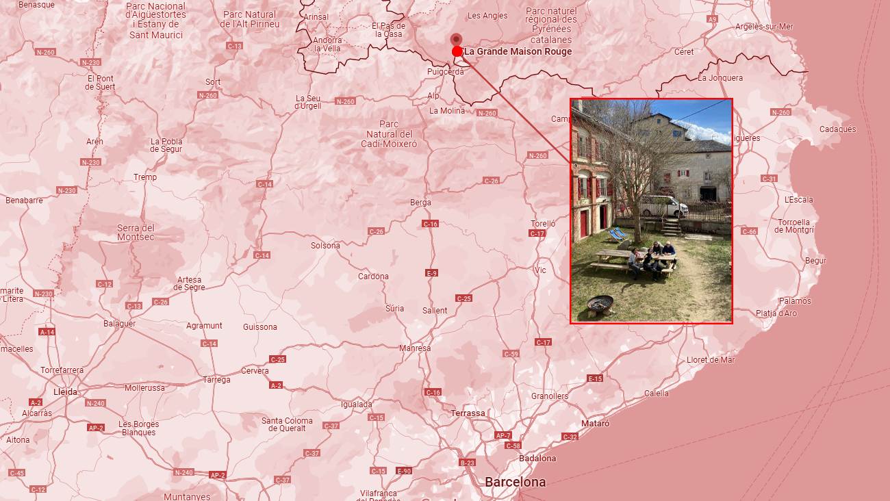
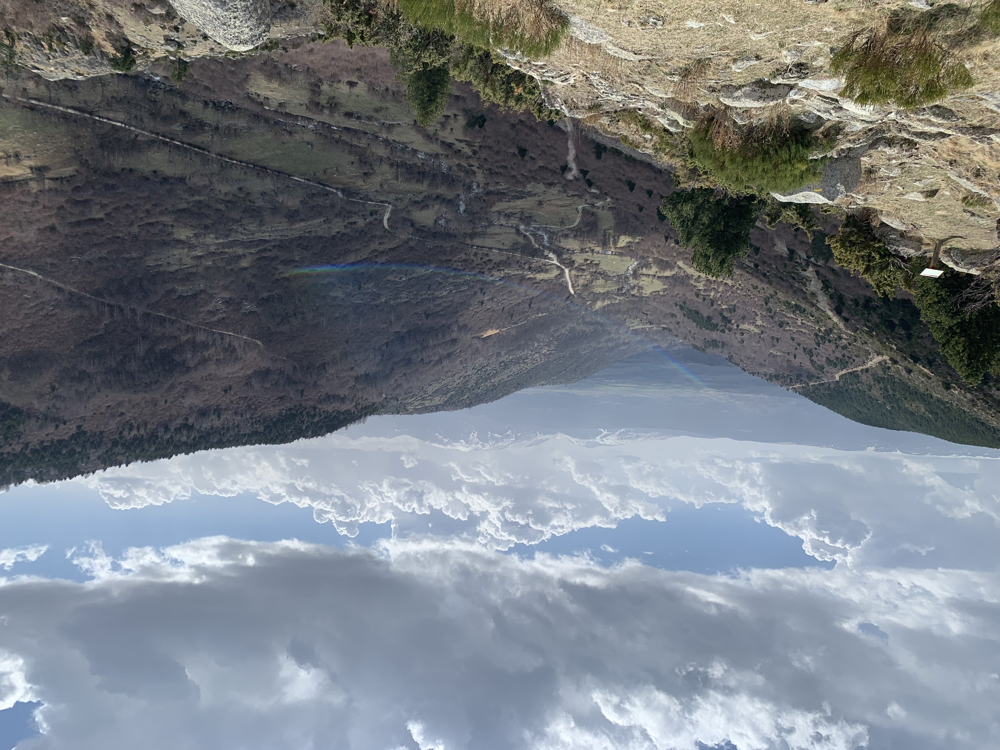
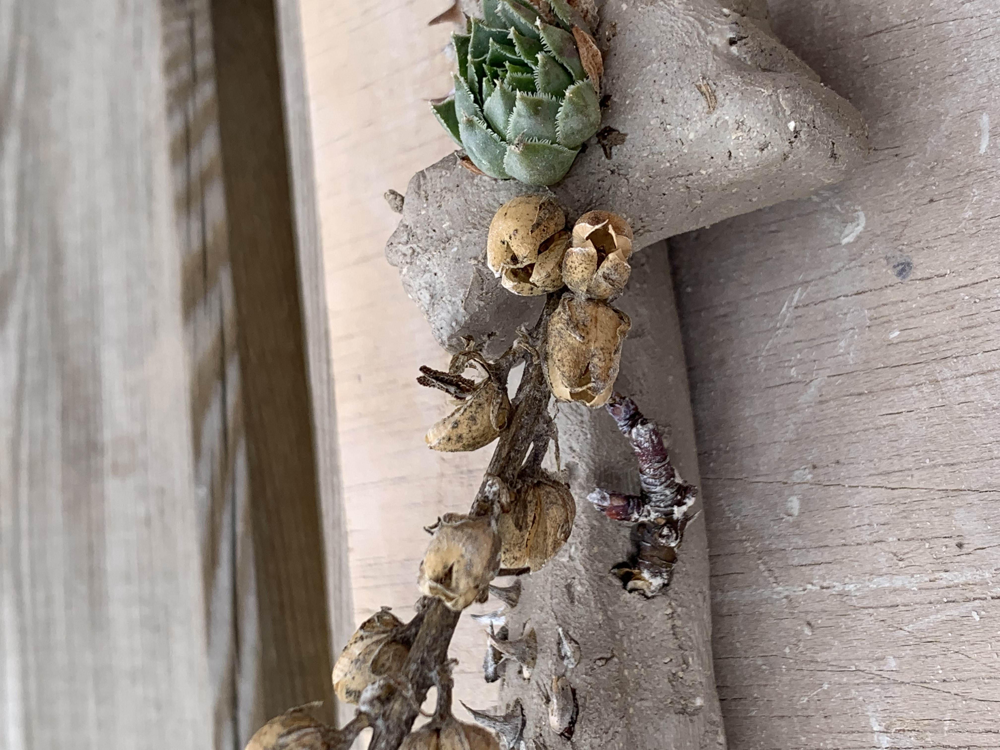
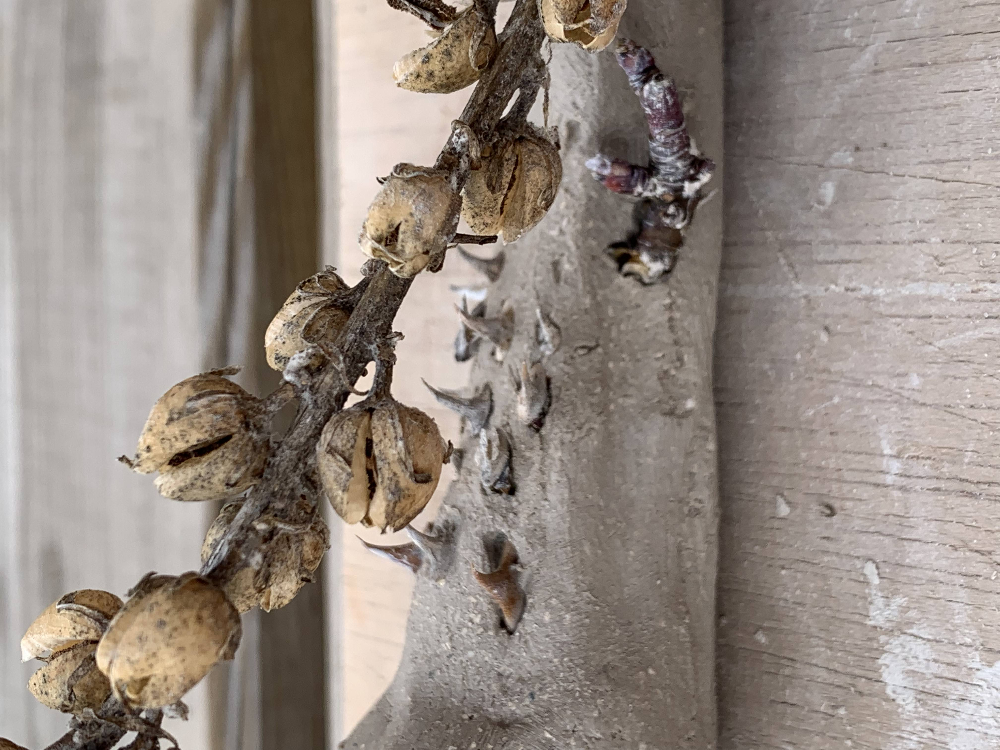
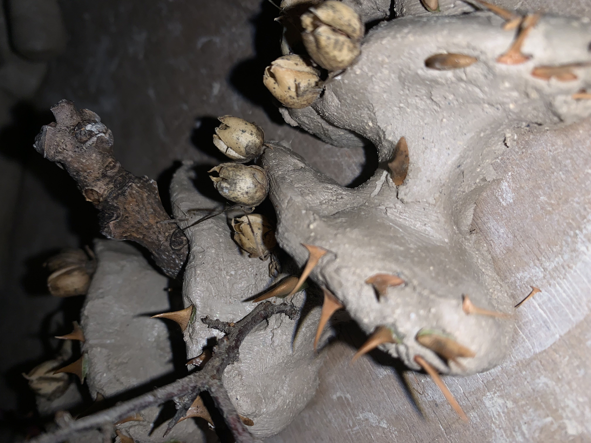
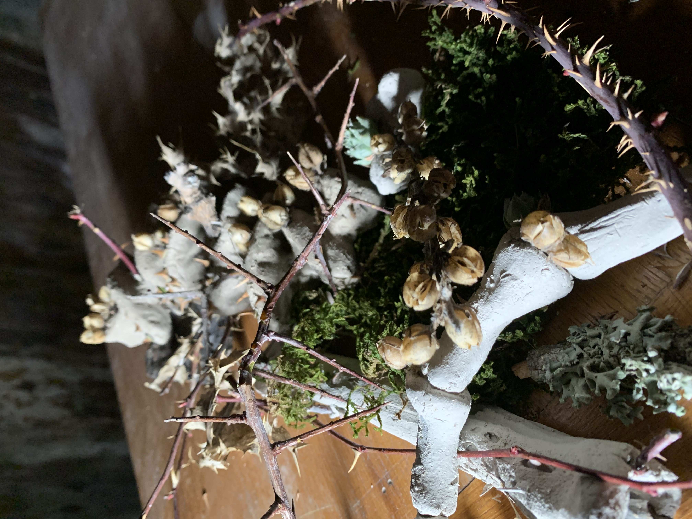

## Where we are
We carried out our research trip in Angoustrine-Villeneuve-des-Escaldes, a small French town nestled in the Pyrenees. We stayed at La Grande Maison Rouge where we all had the opportunity to live and work together in the spaces of the cottage.

## Activites
The week was dedicated to carrying out activities in nature, which could be useful for the production of a small project to be shown at the end of the experience with our personal reflections.
We explored some techniques for recognising and growing plants, and also had a short explanation on the properties of plants, which was very interesting to understand the natural benefits of what surrounds us and how we can use them for our bodies.
{: .image-45-size-left}
We also walked through the adjacent landscapes paying attention to the plants and animals around us, taking care to think and imortalise interesting aspects such as textures, landscape changes, curious shapes or simply reflections.

## My project: Hostile landscapes

During the walk, I was thinking how my project, despite being really distant as topics, could find a connection with the nature we were experiencing during this week.
I then became aware of the parts where nature (in this case flora) becomes hostile to humans or any other entity: by hostility I am referring to methods it devises to preserve itself, to ward off who or what could harm it. And so does the body: it devises both biological and psychological systems to allot violence and attacks to our body
Thus, edgy shapes and spines resemble hairs and bones, the purpose merges for the same reason; fear or resistance.
 

### ispo

I then handcrafted clay bones with hostile netural elements that I collected from the landscape surrounding the cottage, recreating a small natural setting that intimates not to approach or touch it.
{: .image-45-size-left}
{: .image-45-size-right}
 
{: .image-45-size-left}
.jpg){: .image-45-size-right}
 
.jpg){: .image-45-size-left}
{: .image-45-size-right}
 
 
 
 
!!! danger ""

    #### Reflection
    Overall it was a very nice and interesting experience because I had the opportunity to explore another point of view of my project and to work with materials that I don't have available to me on a daily basis. The time factor was also important for me: for a week, time slowed down and I feel I had the chance to enjoy the activities we did more.
    
    I must say, however, that I want to make a special point about food: in a week together we organised our meals in such a way that everyone cooked, and the majority tried their hand at recipes and dishes from their home countries. For me, food is what can bind people who come from different places, and it was very nice to see my companions cooking, learning from them, and helping each other.
