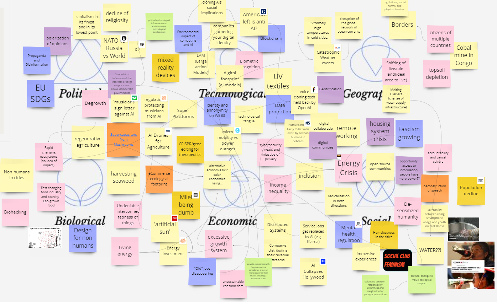

Unfortunately, I was not physically present in class to conduct this seminar, but I completed the activities at a later date in order to come up with new ideas for cards for the atlas of weak signals deck.

 
First of all, I started the activity by looking at what my colleagues had brainstormed and what themes they had developed for the exercise. Although my colleagues had already worked on some very interesting themes, the social area of the map caught my attention, and more specifically the concepts of human society's apathy in the face of misfortune or violence around us and a dynamic more related to the deconstruction of language (which can be considered positively or negatively).
I found these two themes really pertinent to my project on gender violence and it made me reflect on how there is a ==lack of empathy==, that feeling necessary for a generalised change and not only in the individual.
Without empathy, the barbarities we experience every day or hear about will not cease to exist due to human selfishness, certainly, but also due to the overload of violent and newsworthy content.

 
In these two tables I have included examples, case studies and ideas realising my theme, namely Designing in a perspective of care: i.e. creating a space in the card deck that makes one reflect on what it means to care for oneself and others actively and passively in order to feel individuallymlentally and collectively free to be.
 
I developed the following cards:

{: .image-45-size-right}
 
They touch on issues at the behavioural, linguistic, ethical and practical levels; all areas that I consider important for triggering dialogues and developing ideas on how to stem these social problems.

!!! danger ""

    #### Reflection
    I have to say that it was not easy to work on these activities alone as a group dynamic for reflection and brainstorming is much better to get different points of view, but in my case it is only my own related to the thesis project I am developing here. However, I really enjoyed creating the cards that contain the reflections I made and I hope they can really be useful for creating dialogues between people and maybe new ideas and dynamics pder e

