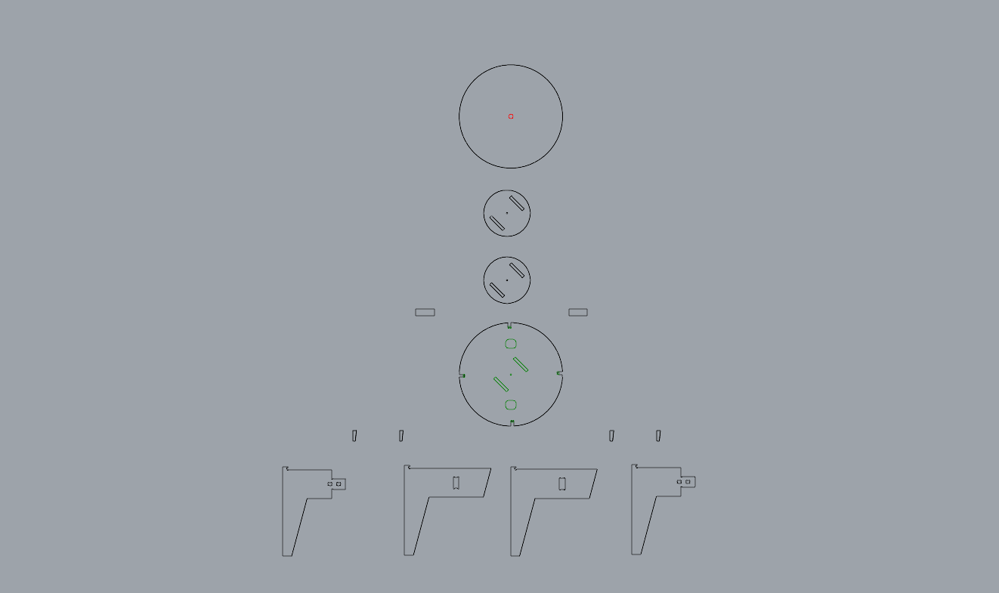
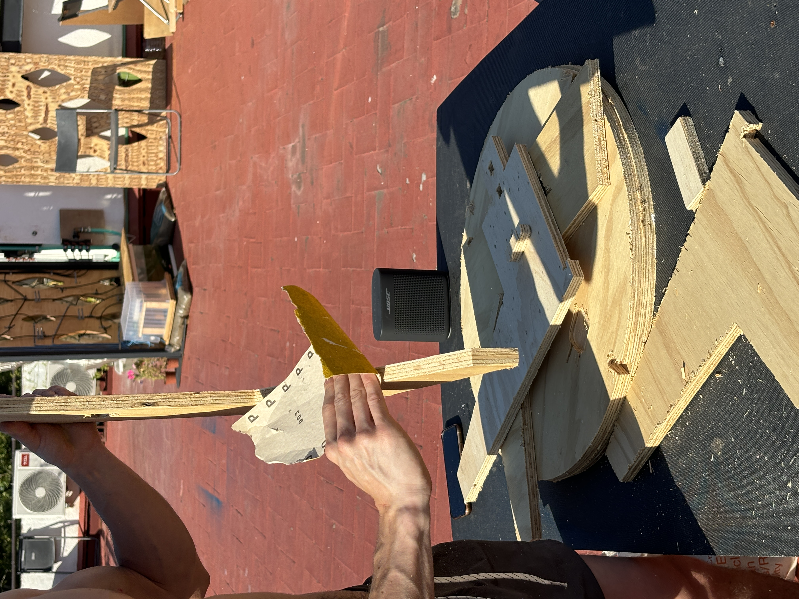

## Task 3

*Creating an artifact using CNC machine with Everardo, Sophie and Jorge*

### First step, ideating a spinning table
My groupmates and I initially wanted to make an electric pottery wheel for the classroom so that we (and future students) could use it to create small clay pots.
Unfortunately, in order to create this artefact, we needed a motor powerful enough to support the weight of the wheel and that would turn at a speed high enough to mould the clay. Not having the latter, we arrived at the fantastic compromise of making a manual spinning table (which is still cool! ;) ).

{: .image-45-size-left}
We initially wondered about the shape of the table and since another group had made a seat for the class we decided to make the height of the table similar so that we could work using all the two manufactured artefacts.  
For the rotation system, we thought of making the structure rotate around a threaded bar in the centre; but that's not all: we added two small wheels on opposite sides to make the rotation more stable

### Second step, building the spinning table!
After making the pattern (and making sure that the shapes and minures are suitable for the cnc) we made the necessary gcode to make the machine understand how to cut the material according to the design.

{: .image-45-size-right}
{: .image-45-size-left}
### Final considerations
I think the CNC is a great fabrication tool that I would like to learn to use more because it allows so many different types of design, however I have found it even more complex than other machines because there are so many more aspects to take into account for the model and for cutting that I have yet to learn better.  
For example, even the type of wood if not combined with the right tool can cut in the wrong way (as in our case where the wood got more damaged than expected). 
I honestly enjoyed assembling on the table because I noticed during this master's course that I focused a lot on electronics, data and so on, ignoring manufacturing, which is also something I have to work on and want to work on as a designer and in which you never stop learning!

### Result

[Fabrication files!](https://drive.google.com/file/d/1NvgUB4E_gS0oH-8jtitPROeM8MrmTSxr/view?usp=drive_link)
## Task 4, Prototyping for interaction design

*Prototype and train a model that has three different OSC messages with Carmen*

Both Carmen and I are working on our projects in the more social sphere.
The reference was to create a kind of online phone call where, based on the emotions and movements detected, the camera feed would change colour and sound depending on how the person on the other end interacts with you. 
The inputs should be: Soft sensor, phone and face.

{: .image-55-size-left}

### Soft sensor
we started by developing these first sensors created with fabrics and the velostat, i.e. this marial that allows the resistance between two charges to vary and thus be able to measure the pressure applied at a given point. We first created a single sensor and then a matrix that, connected to processing, could map the area of the sensor and detect the position of where the change in pressure is applied to the touch

(gif here)

### Second step, translating emotions into data
Our goal was to train a model to recognize emotions through different types of movements: anger, indicated by aggressive movements; happiness, shown by fluid movements; and confusion, characterized by minimal movement. The third input is a soft sensor that can pause all subsequent inputs. Essentially, face and phone tracking are similar as they both aim to recognize feelings and emotions, while the soft sensor acts as a switch, modifying how Wekinator and Max8 process inputs and outputs.

### Final considerations
We were therefore able to train a model such as Wekinator by combining facial expressions with body language using both a camera and sensors. it was very interesting for me to implement a more 'emotional' connotation to my body language reading research (part of my thesis project) rather than a broadly physical one. 
Of course, it is not so direct and simple to create an intelligence that can accurately recognise human emotions as they are influenced by many factors 

## Final video

<iframe width="560" height="315" src="https://www.youtube.com/embed/KlrL4ZGIO6s?si=N830Mjcy5HCZkdNf" title="YouTube video player" frameborder="0" allow="accelerometer; autoplay; clipboard-write; encrypted-media; gyroscope; picture-in-picture; web-share" referrerpolicy="strict-origin-when-cross-origin" allowfullscreen></iframe>

[Arduino and Wekinator files!](https://drive.google.com/drive/folders/1MikflwB34YotAWqRJw89eskvKkQK2kZk?usp=sharing)

## Task 5, Output visuals

*Create a visuals tha visualize your trained model with Carmen*
Starting from the model we had trained, Carmen and I simulated a visual and sound output that recognized moods during a video call

### Ideating the sequence of outputs
The main objective is to alter the inputs through sound and video, attempting to manipulate the visuals to touch upon various aspects of the video recieved.
The computer altered the camera feed and audio output based on the movements and emotions we conveyed. The soft sensor was mainly employed to produce a negative or pause effect on the camera feed. Essentially, while the emotions detected prompted changes in the image, the soft sensor allowed us to pause, switch, and create a negative version of the camera feed.

### Final considerations
The purpose, was to simulate a video call between us where I would change moods by interacting with the sensor in the phone, and face tracking, bringing out different colors and sounds in Carmen's screen that could make her understand this mood change.  
As a project, it may seem like a little research end in itself, but I have to say that we learned a lot of how to modify visual and sound effects that I will definitely use in the future-I'm really interested in the world of interactions and how to connect different inputs to each other in order to make them interact with their surroundings and with people.
## Final video
<iframe width="560" height="315" src="https://www.youtube.com/embed/C4JTLCt9FJ0?si=3mFwbgBvQyJlsO-O" title="YouTube video player" frameborder="0" allow="accelerometer; autoplay; clipboard-write; encrypted-media; gyroscope; picture-in-picture; web-share" referrerpolicy="strict-origin-when-cross-origin" allowfullscreen></iframe>

[Max8 files!](https://drive.google.com/drive/folders/1tu5ag2uHh_FHIjiZ3CIBKoR3howRwg7L?usp=sharing)